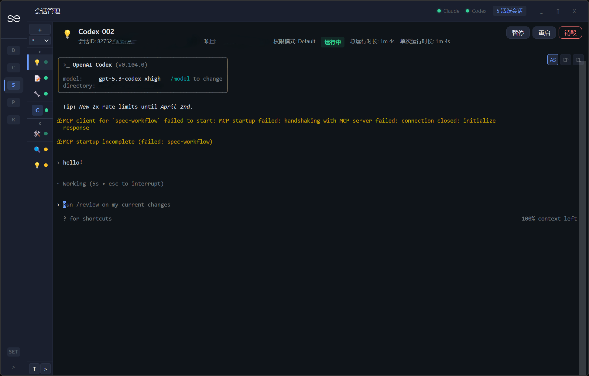

<p align="right">
  <strong>English</strong> | <a href="README.zh-CN.md">简体中文</a>
</p>

<p align="center">
  
</p>

<h1 align="center">EasySession</h1>

<p align="center">Native Terminal, Unified Management</p>

<p align="center">
  
  
  
  
  
</p>

---

## About

EasySession is a lightweight desktop app that provides unified graphical session management for AI CLI tools (Claude CLI, Codex CLI, Gemini CLI, etc.).

Resuming a CLI session is easy (`--resume`), but when you have multiple projects with multiple sessions each, opening terminals, switching directories, and typing commands every time gets tedious. EasySession puts all your projects and sessions in one interface — just click to launch or switch.

## Screenshot

<p align="center">
  
</p>

## Why EasySession

| | Traditional | EasySession |
|---|---|---|
| **Start session** | Open terminal → cd directory → type command | One click to launch |
| **Switch projects** | Juggle multiple terminal windows | Unified interface, instant switch |
| **CLI experience** | Full native | Still full native (embedded terminal) |
| **Resume session** | Manual `--resume` | Auto-tracked, one-click resume |

> We don't reinvent the wheel — CLI tools are already powerful enough. EasySession embeds the native terminal to render CLI directly, rather than parsing output into a ChatGPT-style chat UI, so you get full access to all native CLI features.

## Features

- 🖥️ **Session Management** — Create, resume, and group CLI sessions, one-click to restore previous context
- ⚡ **Native Terminal Embedding** — Built on xterm.js + node-pty, fully preserving native CLI experience
- 🔌 **Multi-CLI Support** — Claude CLI & Codex CLI supported, Gemini CLI and more planned
- 📁 **Project Management** — Organize sessions by project, bind working directories, quick switch
- 📊 **Dashboard** — Overview of all session states and project status at a glance
- ⚙️ **Config Editor** — GUI-based CLI config editing with live change detection
- 🧩 **Skill Browser** — Browse and preview global/project-level CLI Skills
- 🌐 **i18n** — English / 简体中文

## Getting Started

### Prerequisites

- [Node.js](https://nodejs.org/) >= 18
- At least one supported AI CLI tool:
  - [Claude CLI](https://platform.claude.com/docs/en/home)
  - [Codex CLI](https://github.com/openai/codex)
  - More coming soon (Gemini CLI, etc.)

### Option 1: Download Release

Go to the [Releases](../../releases) page to download the latest installer.

### Option 2: Build from Source

```bash
git clone https://github.com/luzhuzhuzhu/easy-session.git
cd easy-session
npm install
npm run dev
```

## Tech Stack

| Tech | Version | Purpose |
|------|---------|---------|
| Electron | 33 | Desktop framework |
| Vue | 3.5 | UI framework |
| TypeScript | 5.9 | Type safety |
| Pinia | 2.3 | State management |
| xterm.js | 6.0 | Terminal emulation |
| node-pty | 1.1 | Pseudo-terminal |
| SCSS | — | Styling |
| electron-vite | 2.3 | Build tool |

## Roadmap

- [x] Claude CLI support
- [x] Codex CLI support
- [x] Session grouping & project management
- [x] i18n (English / 简体中文)
- [ ] Gemini CLI support
- [ ] macOS / Linux support
- [ ] Session history search

## Development

```
src/
├── main/           # Main process (services, IPC)
├── preload/        # Preload scripts
└── renderer/src/   # Renderer (Vue 3 + Pinia)
```

```bash
npm run dev          # Dev server (hot reload)
npm run build:win    # Build Windows installer
npm run test         # Unit tests (vitest)
npm run test:e2e     # E2E tests (Playwright)
```

## License

This project is licensed under [CC BY-NC-SA 4.0](LICENSE).

**Non-commercial use only.** You are free to share and adapt this project, but you must give credit, may not use it for commercial purposes, and derivative works must use the same license.
