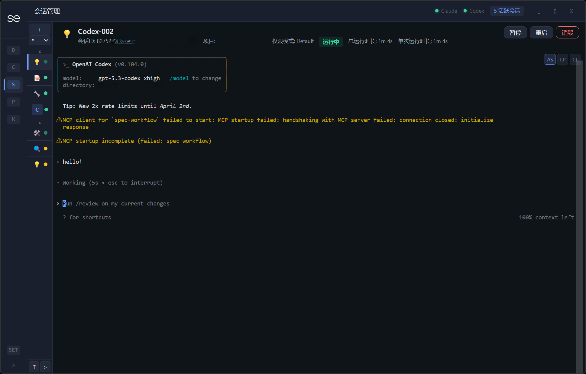

<p align="right">
  <a href="README.md">English</a> | <strong>简体中文</strong>
</p>

<p align="center">
  
</p>

<h1 align="center">EasySession</h1>

<p align="center">原生终端，统一管理，远程可达</p>

<p align="center">
  
  
  
  
  
  
</p>

---

## 项目简介

EasySession 是一款轻量级桌面应用，为 AI CLI 工具（Claude CLI、Codex CLI、OpenCode CLI 等）提供统一的图形化会话管理，并提供面向浏览器与移动端的远程 Web 入口。

CLI 恢复会话本身很简单（`--resume`），但当你有多个项目、每个项目多个会话时，每次都要打开终端、切目录、敲命令——这很繁琐。EasySession 把本地与远程的项目和会话集中在一个界面，点一下就能启动、切换、挂载，或者直接从浏览器继续操作。

## 功能截图

<p align="center">
  
</p>

## 亮点速览

- 🚀 **0.3.0 不再只是本地启动器** —— 远程 Web、桌面端远程挂载、本地/远程统一资源模型都已经落地
- 🖥️ **CLI 体验仍然是原生的** —— 终端透传优先，提示、快捷键、恢复流程和真实 CLI 行为都尽量保留
- 🌍 **在你所在的地方继续工作** —— 桌面端适合日常主力使用，浏览器 / 手机端适合远程进入，远程挂载适合多机器统一管理
- 🔐 **面向真实远程场景** —— Token 认证、实时 Socket 桥接、反代友好路由，并兼容 Cloudflare Tunnel 等接入方式

## 为什么选择 EasySession

| | 传统方式 | EasySession |
|---|---|---|
| **启动会话** | 打开终端 → cd 目录 → 敲命令 | 点一下启动 |
| **多项目切换** | 多个终端窗口来回切 | 统一界面，即点即切 |
| **CLI 体验** | 原生完整 | 同样原生完整（嵌入式终端） |
| **会话恢复** | 手动 `--resume` | 自动记录，一键恢复 |
| **远程访问** | 手动暴露端口 / SSH 到另一台机器 | 内置远程 Web 入口，并支持在桌面端挂载远程实例 |

> 我们不重新造轮子——各家 CLI 本身已经足够强大。EasySession 直接嵌入原生终端渲染 CLI，而不是解析输出做成类 ChatGPT 的聊天界面，让你完整使用 CLI 的所有原生功能。

## 核心特性

- 🖥️ **会话管理** — 创建、恢复、暂停、重启、分组管理 CLI 会话，一键回到之前的工作上下文
- ⚡ **原生终端嵌入** — 基于 xterm.js + node-pty，完整保留真实 CLI 提示、流式输出和快捷键行为
- 🤖 **多 CLI 支持** - 已支持 Claude CLI、Codex CLI、OpenCode CLI，计划支持 Gemini CLI 等更多工具
- 🪟 **应用内分窗工作区** - 支持多 Pane 分窗，支持分窗、关闭、均分、重置布局
- 🌉 **桌面端远程挂载** - 可将多个 EasySession 远程实例挂回同一个桌面工作区，统一查看项目和会话
- 📱 **远程 Web 访问** - 提供独立的浏览器 / 移动端远程 Web，支持实时终端透传、项目树与响应式操作
- 🔐 **远程服务与 Tunnel 支持** - 内置本地远程服务、Token 认证、反向代理支持，并兼容 Cloudflare Tunnel 等浏览器访问场景
- 🌲 **项目级会话树** — 以项目为中心组织会话，绑定工作目录，减少来回切终端和切路径
- 📊 **仪表盘总览** — 一目了然查看所有会话状态和项目概况
- ⚙️ **配置编辑** — 图形化编辑 CLI 配置，实时监听变更
- 🧩 **技能浏览** — 浏览和预览 CLI 全局 / 项目级 Skill
- 🧠 **智能优先级排序** - 可按启动 / 使用信号对项目卡与会话树排序，支持开关与策略调整
- 🌐 **多语言** — 支持 English / 简体中文

## 本地 + 远程使用形态

| 模式 | 适合什么场景 | 你会得到什么 |
|---|---|---|
| **本地桌面端** | 日常单机主力使用 | 原生终端、分窗工作区、仪表盘、配置编辑、项目/会话统一管理 |
| **桌面端 + 远程挂载** | 多台机器统一管理 | 将远程实例挂回同一个桌面工作区，统一查看项目与会话 |
| **远程 Web** | 浏览器 / 手机端远程进入 | 轻量远程界面、实时终端透传、项目树、响应式布局、快捷会话操作 |

## 快速开始

### 前置条件

- [Node.js](https://nodejs.org/) >= 18
- 至少安装一个支持的 AI CLI 工具：
  - [Claude CLI](https://platform.claude.com/docs/en/home)
  - [Codex CLI](https://github.com/openai/codex)
  - OpenCode CLI
  - 更多 CLI 支持计划中（Gemini CLI 等）

### 方式一：下载安装包

前往 [Releases](../../releases) 页面下载最新版本的安装程序。

### 方式二：从源码构建

```bash
git clone https://github.com/luzhuzhuzhu/easy-session.git
cd easy-session
npm install
npm run dev
```

### 方式三：使用远程 Web

1. 在目标 Windows 机器上启动 EasySession
2. 在设置中启用本地远程服务
3. 在浏览器中打开生成的远程地址，或者通过你自己的反代 / Cloudflare Tunnel 暴露出去
4. 使用远程 Token 登录，然后继续从桌面端或移动端操作会话

## 技术栈

| 技术 | 版本 | 用途 |
|------|------|------|
| Electron | 33 | 桌面应用框架 |
| Vue | 3.5 | UI 框架 |
| TypeScript | 5.9 | 类型安全 |
| Pinia | 2.3 | 状态管理 |
| xterm.js | 6.0 | 终端模拟 |
| node-pty | 1.1 | 伪终端进程 |
| Express + Socket.IO | 4.21 / 4.8 | 远程服务、Web 访问与实时同步 |
| SCSS | — | 样式 |
| electron-vite | 2.3 | 构建工具 |

## Roadmap

- [x] Claude CLI 支持
- [x] Codex CLI 支持
- [x] OpenCode CLI 支持
- [x] 应用内分窗工作区（多 Pane）
- [x] 桌面端远程挂载与本地/远程统一网关
- [x] 浏览器 / 移动端远程 Web 访问
- [x] 项目/会话智能优先级排序
- [x] 会话分组与项目管理
- [x] 多语言（English / 简体中文）
- [ ] Gemini CLI 支持
- [ ] macOS / Linux 支持
- [ ] 会话历史搜索

## 开发

```
src/
├── main/           # 主进程（服务、IPC、远程服务）
├── preload/        # 预加载脚本
└── renderer/src/   # 渲染进程（Vue 3 + Pinia）
```

```bash
npm run dev          # 启动开发服务器（热重载）
npm run build:win    # 构建 Windows 安装程序
npm run test         # 单元测试（vitest）
npm run test:e2e     # 端到端测试（Playwright）
```

## 许可证

本项目采用 [CC BY-NC-SA 4.0](LICENSE) 许可证。

**仅供非商业用途。** 你可以自由分享和修改本项目，但必须注明出处、不得用于商业目的，且衍生作品须以相同许可证发布。
