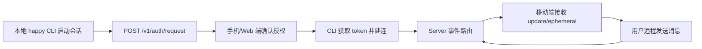
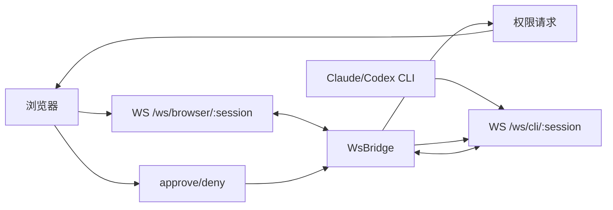
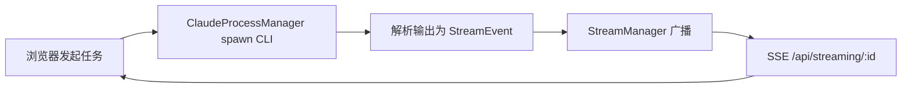
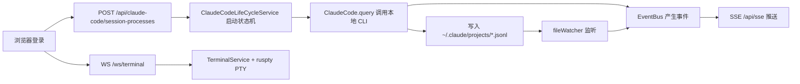
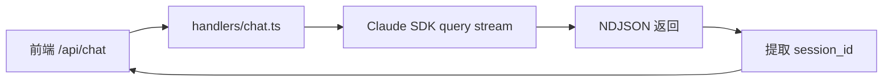
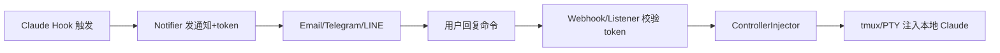
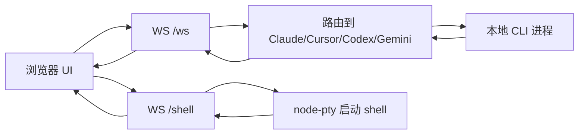
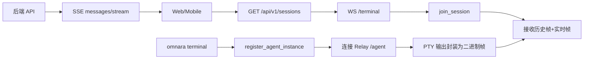

# 远程 CLI 集成方案指南

> 基于 12 个开源项目的技术调研与实现分析
> 更新时间：2026-03-04

## 概览

本文档分析了 12 个实现远程操控本地 Claude/Codex CLI 的开源项目，涵盖从简单的 Web UI 到完整的多端协同平台。

### 项目状态速览

| 项目 | 状态 | 技术栈 | 远程方式 | 认证方式 |
|------|------|---------|----------|----------|
| slopus/happy | ✅ 活跃 | Node + Socket.IO | WebSocket 双向同步 | OAuth + Token |
| siteboon/claudecodeui | ✅ 活跃 | Express + WS | WebSocket 消息路由 | JWT |
| 21st-dev/1code | ✅ 活跃 | Electron + tRPC | 本地优先 + 云导入 | Desktop OAuth |
| The-Vibe-Company/companion | ✅ 活跃 | Bun + Hono + WS | 双向 WebSocket 桥接 | Token |
| wbopan/cui | ✅ 活跃 | Express + SSE | 服务端推送流 | Bearer Token |
| JessyTsui/Claude-Code-Remote | ✅ 活跃 | Node + Email/IM | 命令注入 (tmux/PTY) | Session Token |
| sugyan/claude-code-webui | ✅ 活跃 | Hono + React | SDK 封装 + NDJSON | 无（本地优先）|
| d-kimuson/claude-code-viewer | ✅ 活跃 | Hono + Effect | SSE + WebSocket | Cookie/Bearer |
| BloopAI/vibe-kanban | ✅ 活跃 | Rust + Axum | SSE + WS + Relay | 签名验证 |
| sunpix/claude-code-web | ✅ 活跃 | Nuxt 4 + Nitro | WebSocket 核心 | 无（本地优先）|
| omnara-ai/omnara | ⚠️ 已停更 | Python + FastAPI | Relay 二进制帧 | API Key |
| cablate/Claude-Code-Board | ⚠️ 已停更 | Express + Socket.IO | 流式解析 + 推送 | JWT |

---

## 技术方案分类

### 1. WebSocket 双向通信型

**代表项目**：happy, companion, claudecodeui, claude-code-web

**核心思路**：
- 浏览器与服务端建立 WebSocket 长连接
- 服务端作为中间层，转发浏览器指令到本地 CLI
- CLI 输出实时回传到浏览器

**技术特点**：
```
浏览器 <--WebSocket--> 服务端 <--进程管理--> 本地 CLI
```

**优势**：
- 实时性强，延迟低
- 支持双向交互（输入/输出/控制）
- 适合多端同步场景

**劣势**：
- 需要维护连接状态
- 服务端需要处理断线重连
- 并发连接数受限

### 2. SSE 服务端推送型

**代表项目**：cui, claude-code-viewer, vibe-kanban

**核心思路**：
- 使用 Server-Sent Events (SSE) 单向推送
- 客户端通过 HTTP POST 发送指令
- 服务端通过 SSE 流式返回结果

**技术特点**：
```
浏览器 --HTTP POST--> 服务端
浏览器 <--SSE 流----- 服务端 <--> 本地 CLI
```

**优势**：
- 实现简单，HTTP 原生支持
- 自动重连机制
- 适合单向数据流场景
- 可与 WebSocket 混合使用（终端/审批等交互场景）

**劣势**：
- 单向通信，交互需额外 HTTP 请求
- 浏览器并发 SSE 连接数有限（通常 6 个）

### 3. SDK 直接封装型

**代表项目**：claude-code-webui, claude-code-web

**核心思路**：
- 直接使用 `@anthropic-ai/claude-code` SDK
- 服务端调用 `query()` 驱动本地 CLI
- 流式消息通过 NDJSON 或 WebSocket 返回

**技术特点**：
```
浏览器 --> 服务端 API --> Claude SDK query() --> 本地 CLI
```

**优势**：
- 实现最简单，代码量少
- 直接复用官方 SDK 能力
- 会话恢复由 SDK 处理（sessionId + resume）

**劣势**：
- 依赖 SDK 版本更新
- 功能受限于 SDK 提供的接口
- 不适合需要深度定制的场景

### 4. 命令注入型

**代表项目**：Claude-Code-Remote

**核心思路**：
- 通过 Email/Telegram/LINE 等通道接收远程指令
- 使用 tmux send-keys 或 PTY 将命令注入到本地运行的 CLI 会话
- 通过 Claude hooks 触发通知

**技术特点**：
```
远程通道 (Email/IM) --> Webhook/监听器 --> tmux/PTY 注入 --> 本地 CLI 会话
```

**优势**：
- 无需专用客户端，利用现有通讯工具
- 适合移动端远程控制
- 实现轻量，依赖少

**劣势**：
- 实时性较差（依赖轮询或 webhook）
- 安全性依赖 token 机制
- 不适合需要实时交互的场景

### 5. Electron 本地优先型

**代表项目**：1code

**核心思路**：
- 桌面应用本地运行，通过 tRPC 组织进程通信
- 支持从云端导入会话到本地继续工作
- 每个会话绑定独立 git worktree

**技术特点**：
```
Electron 渲染进程 <--tRPC--> 主进程 <--> 本地 CLI + worktree
                                    ↓
                              云端 API (可选导入)
```

**优势**：
- 本地优先，性能好
- 数据隔离（独立 worktree）
- 可离线工作

**劣势**：
- 需要安装桌面应用
- 不支持纯 Web 访问
- 跨设备同步需额外实现

---

## 核心技术对比

### 通信协议选择

| 协议 | 实时性 | 双向通信 | 实现复杂度 | 适用场景 |
|------|--------|----------|------------|----------|
| WebSocket | ⭐⭐⭐⭐⭐ | ✅ | 中 | 实时交互、多端同步 |
| SSE | ⭐⭐⭐⭐ | ❌ (需配合HTTP) | 低 | 单向推送、日志流 |
| HTTP Long Polling | ⭐⭐ | ❌ | 低 | 兼容性要求高 |
| 命令注入 | ⭐ | ✅ | 低 | 移动端远程控制 |

### 进程管理方式

| 方式 | 代表项目 | 优势 | 劣势 |
|------|----------|------|------|
| `child_process.spawn` | 大部分项目 | 简单直接 | 需手动处理输出解析 |
| `node-pty` | claudecodeui, companion | 完整终端模拟 | 依赖原生模块 |
| SDK `query()` | claude-code-webui | 官方支持，稳定 | 功能受限 |
| tmux send-keys | Claude-Code-Remote | 注入现有会话 | 依赖 tmux |

### 会话持久化策略

| 策略 | 代表项目 | 说明 |
|------|----------|------|
| 文件监听 `~/.claude/projects` | claude-code-viewer, claude-code-web | 监听官方会话文件变化 |
| 数据库存储 | Claude-Code-Board, vibe-kanban | 完整的消息历史和状态管理 |
| SDK sessionId | claude-code-webui | 依赖 SDK 的 resume 机制 |
| 内存状态 + 可选持久化 | companion, cui | 轻量级，重启丢失 |

---

## 项目详细分析

### 🌟 slopus/happy - 多端协同平台

**架构特点**：
- Monorepo 结构（Yarn workspace）
- 组件：Web/移动端、CLI、Server、Agent、Wire
- 后端：Fastify + Socket.IO + Prisma
- CLI：Node/TS，封装 Claude/Codex，带 daemon

**远程实现方案**：

本地 CLI 启动会话后上报到 `happy-server`，设备间通过 Socket.IO 同步会话事件。服务端维护三层连接模型：
- session-scoped：会话级连接
- user-scoped：用户级连接
- machine-scoped：设备级连接

**认证流程**：
1. 终端请求授权：`POST /v1/auth/request`
2. 移动端确认：`POST /v1/auth/response`
3. CLI 获取 token 并建连：`/v1/updates`

**流程图**：


**核心代码**：
- `packages/happy-server/sources/app/api/socket.ts` - Socket.IO 连接管理
- `packages/happy-server/sources/app/events/eventRouter.ts` - 事件路由
- `packages/happy-cli/src/claude/runClaude.ts` - CLI 执行层

**快速开始**：
```bash
# 使用 happy 替代 claude
happy

# 使用 happy codex 替代 codex
happy codex
```

---

### 🔧 The-Vibe-Company/companion - WebSocket 桥接方案

**架构特点**：
- 后端：Bun + Hono + `ws`
- 核心组件：`CliLauncher` + `WsBridge` + `SessionStore`
- 支持 Claude/Codex，多会话与权限审批流

**远程实现方案**：

使用双向 WebSocket 桥接模式：
- 浏览器连接：`ws://.../ws/browser/:session`
- CLI 连接：`ws://.../ws/cli/:session`
- `WsBridge` 在两个 socket 间做协议翻译和状态管理

**权限审批流程**：
1. CLI 发起工具权限请求：`control_request(can_use_tool)`
2. UI 展示审批界面
3. 用户决策后回传：`control_response`

**流程图**：


**核心代码**：
- `web/server/index.ts` - 服务入口
- `web/server/ws-bridge.ts` - WebSocket 桥接核心
- `web/server/cli-launcher.ts` - CLI 启动器
- `web/server/auth-manager.ts` - 认证管理（`~/.companion/auth.json`）

**快速开始**：
```bash
# 快速启动
bunx the-companion

# 安装为服务
the-companion install && the-companion start

# 访问
open http://localhost:3456
```

---

### 📡 wbopan/cui - SSE 流式推送方案

**架构特点**：
- 后端：Express + SSE（`text/event-stream`）
- 前端：React（Vite）
- 进程管理：`ClaudeProcessManager`
- 流管理：`StreamManager` 负责多客户端广播

**远程实现方案**：

采用 SSE 单向推送模式，客户端通过 HTTP POST 发起任务，通过 SSE 接收实时输出：
- 前端发起会话请求
- 后端 spawn Claude CLI
- 输出解析为事件后广播到对应 `streamingId`
- 客户端通过 `/api/streaming/:streamingId` 持续接收

**流程图**：


**核心代码**：
- `src/cui-server.ts` - 服务主入口
- `src/services/claude-process-manager.ts` - 进程管理
- `src/services/stream-manager.ts` - 流管理与广播
- `src/routes/streaming.routes.ts` - SSE 路由
- `src/middleware/auth.ts` - Bearer Token 认证

**特点**：
- 支持多任务并行
- 页面关闭后任务可继续运行
- 适合长时间运行的任务

**快速开始**：
```bash
# 启动服务
npx cui-server

# 浏览器访问（带 token）
open http://localhost:3001/#<token>
```

---

### 🎯 d-kimuson/claude-code-viewer - 企业级架构方案

**架构特点**：
- 前后端同仓：React + Vite + Hono
- 服务分层：`Effect` + `Layer` 依赖注入（Infrastructure / Domain / Presentation）
- Claude 执行：`@anthropic-ai/claude-agent-sdk` + 本机 CLI
- 实时通道：SSE（业务事件）+ WebSocket（内置终端）
- 终端实现：`@replit/ruspty` 管理 PTY 会话

**远程实现方案**：

支持远程访问的完整方案：
- 启动参数：`--hostname 0.0.0.0 --password <密码>`
- 认证模式：Cookie（`ccv-session`）或 Bearer Token
- 会话管理：状态机驱动（pending → initialized → paused/completed）
- 文件监听：`~/.claude/projects` 变化推送到 SSE
- 终端面板：`/ws/terminal` 支持输入、resize、断线补帧

**流程图**：


**核心代码**：
- `src/server/main.ts` - 服务入口
- `src/server/core/claude-code/services/ClaudeCodeLifeCycleService.ts` - 生命周期管理
- `src/server/core/events/presentation/SSEController.ts` - SSE 控制器
- `src/server/terminal/terminalWebSocket.ts` - 终端 WebSocket
- `src/server/hono/middleware/auth.middleware.ts` - 认证中间件

**快速开始**：
```bash
# 本地启动
npx @kimuson/claude-code-viewer@latest --port 3400

# 远程访问（带密码）
npx @kimuson/claude-code-viewer@latest \
  --hostname 0.0.0.0 \
  --port 3400 \
  --password <你的密码>

# API-only 模式
npx @kimuson/claude-code-viewer@latest \
  --api-only \
  --password <你的密码>
```

---

### 🦀 BloopAI/vibe-kanban - Rust 高性能方案

**架构特点**：
- 核心后端：Rust + Axum
- 执行层：多代理适配（Claude/Codex/Gemini/Cursor/Amp/OpenCode）
- 前端：本地 Web UI + 共享 UI 核心
- 实时通道：SSE（全局事件）+ WebSocket（执行日志、审批流、终端）
- 远程接入：可选 Relay Tunnel（签名请求 + 签名 WebSocket 帧）

**远程实现方案**：

采用多通道混合架构：
- 执行日志：`/api/execution-processes/:id/raw-logs/ws` 或 `.../normalized-logs/ws`
- 全局事件：`/api/events`（SSE）订阅 workspace/execution/scratch 变化
- 工具审批：`/api/approvals/stream/ws` + `/api/approvals/{id}/respond`
- 终端远控：`/api/terminal/ws`（PTY 服务）
- Relay 模式：签名校验 HTTP 请求和 WebSocket 帧

**流程图**：
```mermaid
flowchart LR
  A[Web UI] --> B[/api/sessions/:id/follow-up]
  B --> C[ContainerService.start_execution]
  C --> D[Spawn 本地 CLI]
  D --> E[MsgStore 累积日志]
  E --> F[/api/execution-processes/*/ws]
  D --> G[审批请求]
  G --> H[/api/approvals/stream/ws]
  I[DB Hook] --> J[/api/events SSE]
  A --> K[/api/terminal/ws]
```

**核心代码**：
- `crates/server/src/routes/sessions/mod.rs` - 会话路由
- `crates/services/src/services/container.rs` - 容器服务
- `crates/executors/src/executors/claude/client.rs` - Claude 执行器
- `crates/server/src/tunnel.rs` - Relay 隧道

**快速开始**：
```bash
# 本地启动
npx vibe-kanban

# 远程反代（设置允许的来源）
VK_ALLOWED_ORIGINS=https://你的域名 npx vibe-kanban

# 启用隧道
VK_TUNNEL=1 npx vibe-kanban
```

---

### 🎨 sugyan/claude-code-webui - 极简 SDK 封装

**架构特点**：
- 后端：Hono（Deno/Node 双运行时）
- 前端：React + Vite
- Claude 接入：`@anthropic-ai/claude-code` 的 `query()` 直接驱动
- 会话连续性：`session_id` + `resume`

**远程实现方案**：

最简单的 SDK 封装方案：
- 前端调用 `POST /api/chat`
- 后端执行 SDK `query()`
- 将 SDK 消息包装为 NDJSON 流返回
- 前端提取 `session_id` 后续请求带上实现会话恢复

**流程图**：


**核心代码**：
- `backend/app.ts` - 应用入口
- `backend/handlers/chat.ts` - 聊天处理器
- `backend/handlers/histories.ts` - 历史记录

**特点**：
- 实现最简单，代码量最少
- 本地优先，README 明确无内建认证
- 适合快速原型和个人使用

**快速开始**：
```bash
# 全局安装
npm install -g claude-code-webui

# 启动（可指定端口）
claude-code-webui --port 8080

# 访问
open http://localhost:8080
```

---

### 📱 JessyTsui/Claude-Code-Remote - 移动端命令注入方案

**架构特点**：
- Node.js + Express
- 通道：Email（SMTP/IMAP）、Telegram、LINE、Desktop
- 命令注入：tmux 或 PTY（`ControllerInjector`）
- 触发：Claude hooks 触发通知

**远程实现方案**：

通过消息通道实现远程控制：
1. 本地 Claude 任务完成/等待时触发 `claude-hook-notify.js`
2. 系统生成 session token，向邮件/Telegram/LINE 推送通知
3. 用户用 token 回发命令（如 `/cmd TOKEN your command`）
4. Webhook/邮件监听器解析命令并校验 token
5. 通过 tmux send-keys 或 PTY 写入命令注入本地会话

**流程图**：


**核心代码**：
- `claude-remote.js` - 主入口
- `src/core/notifier.js` - 通知发送
- `src/channels/telegram/webhook.js` - Telegram webhook
- `src/relay/email-listener.js` - 邮件监听
- `src/utils/controller-injector.js` - 命令注入

**快速开始**：
```bash
npm install

# 配置 .env（SMTP/IMAP、Telegram/LINE token）
cp .env.example .env

# 启动 daemon
node claude-remote.js daemon start

# 或启动特定通道
npm run telegram
npm run line
```

---

### 🌐 sunpix/claude-code-web - Nuxt 全栈方案

**架构特点**：
- Nuxt 4 + Nitro（SSR 关闭，SPA + Node 服务）
- Claude 接入：`@anthropic-ai/claude-code` 的 `query()` 直接驱动
- 交互通道：WebSocket（`/_ws`）为核心，REST API 辅助
- 文件监听：`chokidar` 监听 `~/.claude/projects` 目录变化

**远程实现方案**：

WebSocket 核心 + REST 辅助架构：
- 浏览器通过 `/_ws` 发送 `chat/reconnect-session/abort-session/watch-session/ping`
- `chat` 消息调用 `query({ prompt, options })`，支持 `resume/sessionId/cwd/permissionMode`
- 服务端维护会话状态表（busy/projectId/startTime/lastActivity）
- 通过 chokidar 监听项目与 `*.jsonl` 会话文件变化，广播事件
- REST 侧负责项目发现、会话列表、消息读取、项目设置读写

**流程图**：
```mermaid
flowchart LR
  A[浏览器 /_ws] --> B[type=chat]
  B --> C[query() 调用本地 CLI]
  C --> D[流式消息写入会话状态]
  D --> E[推送 claude-response]
  A --> F[/api/projects + /api/sessions/*]
  G[chokidar 监听 ~/.claude/projects] --> H[广播 project-change/session-*]
  H --> A
```

**核心代码**（npm 包 `@sunpix/claude-code-web@1.2.2`）：
- `.output/server/chunks/nitro/nitro.mjs` - 核心运行时、WS 会话管理
- `.output/server/chunks/routes/api/projects.*.mjs` - 项目 CRUD
- `.output/server/chunks/routes/api/sessions/_sessionId/status.get.mjs` - 会话状态

**特点**：
- README 明确"无认证"，暴露端口即可远程控制
- 支持会话中断（abortController）与会话重连
- 支持语音能力（需配置 `OPENAI_API_KEY`）

**快速开始**：
```bash
# 安装
npm install -g @sunpix/claude-code-web

# 启动
claude-code-web

# 改端口
PORT=8080 claude-code-web

# 子路径反代
APP_BASE_URL=/claude-code claude-code-web

# 启用语音
OPENAI_API_KEY=sk-... claude-code-web
```

**安全建议**：必须放到防火墙或反向代理鉴权后使用

---

### 🔌 siteboon/claudecodeui (CloudCLI UI) - 多 CLI 适配方案

**架构特点**：
- 前端：React + Vite + xterm
- 后端：Express + `ws` + `node-pty`
- 多 CLI 适配：Claude / Cursor / Codex / Gemini
- 本地模式与 Cloud 模式并存

**远程实现方案**：

WebSocket 双通道架构：
- 浏览器通过 WebSocket 连后端（`/ws` 聊天、`/shell` 终端）
- 后端按消息类型路由到不同 CLI 适配器
- 终端侧用 `node-pty` 起 shell，输入输出通过 WebSocket 回传
- 会话可恢复（`sessionId` + resume 逻辑）
- 身份鉴权使用 JWT（单用户模型），API 受 `authenticateToken` 保护

**流程图**：


**核心代码**：
- `server/index.js` - WebSocket、API、PTY 主逻辑
- `server/middleware/auth.js` - JWT + API key
- `server/claude-sdk.js` - Claude 适配器
- `server/cursor-cli.js` - Cursor 适配器
- `server/openai-codex.js` - Codex 适配器

**快速开始**：
```bash
# 全局安装
npm install -g @siteboon/claude-code-ui

# 启动（默认端口 3001）
cloudcli

# 指定端口
cloudcli -p 8080

# 访问
open http://localhost:3001
```

---

### 🖥️ 21st-dev/1code - Electron 桌面应用方案

**架构特点**：
- 桌面端：Electron + React + tRPC（`trpc-electron`）
- 数据层：SQLite（Drizzle）
- 终端能力：`node-pty`
- Agent 执行：Claude SDK + Codex ACP 适配
- 支持本地 worktree 与云 sandbox 相关能力

**远程实现方案**：

本地优先 + 云端导入混合模式：
- 本地桌面应用通过 tRPC 组织主进程与渲染进程通信
- 本地模式：每个会话绑定独立 worktree + 本地 agent 流式输出
- 云/远端相关：通过 `sandbox-import` 路由调用 `21st.dev` API 拉取远端 chat/sandbox 导回本地
- 认证走 desktop OAuth（`/api/auth/desktop/exchange/refresh`），token 加密存储

**流程图（远端导回本地）**：
```mermaid
flowchart LR
  A[1Code Desktop 已登录] --> B[/api/agents/chat/:id/export]
  B --> C[获取 remote chat + subchat]
  C --> D[本地创建 worktree]
  D --> E[importSandboxToWorktree 拉取 sandbox git]
  E --> F[写入本地 subchat + 会话文件]
  F --> G[本地继续接管与运行]
```

**核心代码**：
- `src/main/lib/trpc/routers/claude.ts` - Claude 路由
- `src/main/lib/trpc/routers/codex.ts` - Codex 路由
- `src/main/lib/trpc/routers/terminal.ts` - 终端路由
- `src/main/lib/trpc/routers/sandbox-import.ts` - 云端导入
- `src/main/auth-manager.ts` - 认证管理

**快速开始**：
```bash
# 安装依赖
bun install

# 下载二进制
bun run claude:download
bun run codex:download

# 启动开发
bun run dev
```

---

### ⚠️ omnara-ai/omnara - Python Relay 方案（已停更）

**状态说明**：README 顶部明确该仓库"旧版已停止维护"，在线服务持续到 2025-12-31。当前日期 2026-03-04，若在线服务不可用属于预期。

**架构特点**：
- monorepo 结构：Python 后端/CLI + Web(React) + Mobile(React Native)
- CLI 入口：`src/omnara/cli.py`，支持多种模式
- 终端远控数据面：独立 relay 服务（FastAPI）
- 会话消息/状态面：API + SSE

**远程实现方案**：

双层架构（Relay + API）：
- 本地 CLI 启动时向 API 注册 agent instance（`transport=ws`）
- 连接 relay 的 `/agent?session_id=...`，将本地 PTY 输出封装成二进制帧双向转发
- Web/Mobile 端先请求 relay 的 `/api/v1/sessions` 找会话，再连 `/terminal`
- 发送 `join_session` 加入会话，收到历史输出帧回放 + 实时输出帧
- 聊天/状态侧通过后端 SSE（agent 消息、status_update、git_diff_update）

**远程启动能力**：
- `omnara serve` 提供 webhook 服务（可选 Cloudflare Tunnel）
- 仪表盘/外部调用 webhook 后在本机创建 git worktree
- 启动 headless Claude Runner（Claude SDK + Omnara MCP）在后台执行

**流程图**：


**核心代码**：
- `src/omnara/session_sharing.py` - 会话桥接
- `src/relay_server/app.py` - Relay 服务
- `src/integrations/webhooks/claude_code/claude_code.py` - 远程启动

**快速开始**：
```bash
# 终端镜像（推荐）
omnara terminal --agent claude

# 远程启动入口
omnara serve
```

---

### ⚠️ cablate/Claude-Code-Board - Socket.IO 流式方案（已停更）

**状态说明**：README 顶部明确仓库已停更（archived），最近提交是停更公告（2026-01-28）。

**架构特点**：
- 前后端分离：Backend（Node.js + Express + Socket.IO + SQLite）+ Frontend（React + Vite）
- 会话模型：后端 `sessions/messages` 入库，前端先走 REST 拉历史，再用 WebSocket 收实时流
- Claude 执行层：`ProcessManager` 调 `npx -y @anthropic-ai/claude-code@latest`
- 串流解析核心：`UnifiedStreamProcessor`，统一处理 `assistant/user/system/tool_use` 等消息

**远程实现方案**：

REST + Socket.IO 混合架构：
- 用户在 Web 登录后（JWT），调用 `/api/sessions` 创建本地会话
- 发消息走 `/api/sessions/:sessionId/messages`，后端保存 user 消息
- 按会话状态组装 Claude 命令（新会话 / `--continue` / `--resume=<claudeSessionId>`）
- `UnifiedStreamProcessor` 将 Claude 输出拆成消息事件，一边写 SQLite，一边通过 Socket.IO 发到 `session:{id}` 房间
- 前端通过 `subscribe(sessionId)` 加入房间，接收 `message/status_update/process_exit/error` 等事件
- 支持中断 `/interrupt`、恢复 `/resume`、标记完成 `/complete`

**流程图**：
```mermaid
flowchart LR
  A[浏览器登录 JWT] --> B[POST /api/sessions]
  B --> C[ProcessManager.startClaudeProcess]
  C --> D[npx claude-code --output-format=stream-json]
  D --> E[UnifiedStreamProcessor 解析流]
  E --> F[SQLite 落库]
  E --> G[Socket.IO 推送 session:{id}]
  H[前端 subscribe] --> G
```

**核心代码**：
- `backend/src/services/SessionService.ts` - 会话服务
- `backend/src/services/ProcessManager.ts` - 进程管理
- `backend/src/services/UnifiedStreamProcessor.ts` - 流解析
- `frontend/src/services/websocket.ts` - WebSocket 客户端

**快速开始**：
```bash
# 安装依赖（根目录、backend/、frontend/）
npm install

# 启动（Windows）
start.bat

# 或分别启动
npm run dev:backend
npm run dev:frontend

# 默认登录（若未改环境变量）
# ADMIN_USERNAME=admin
# ADMIN_PASSWORD=admin
```

**安全建议**：仅限本机或受控内网，不要暴露到公网

---

## 技术选型建议

### 根据使用场景选择

**个人本地使用**：
- 推荐：`claude-code-webui`、`claude-code-web`
- 理由：实现简单，无认证开销，快速启动
- 特点：SDK 直接封装，代码量少，维护成本低

**团队内网部署**：
- 推荐：`claude-code-viewer`、`cui`
- 理由：支持密码认证，SSE 推送稳定，适合多用户
- 特点：企业级架构，支持远程访问参数

**多端协同需求**：
- 推荐：`happy`、`companion`
- 理由：WebSocket 双向通信，支持移动端/Web 端同步
- 特点：完整的认证流程，会话状态同步

**移动端远程控制**：
- 推荐：`Claude-Code-Remote`
- 理由：通过 Email/Telegram/LINE 控制，无需专用客户端
- 特点：命令注入方式，适合临时远程操作

**桌面应用需求**：
- 推荐：`1code`
- 理由：Electron 桌面应用，本地优先，支持云端导入
- 特点：独立 worktree，数据隔离

**高性能/生产环境**：
- 推荐：`vibe-kanban`
- 理由：Rust 实现，性能优异，支持 Relay 隧道
- 特点：多代理适配，完整的审批流和终端能力

### 根据技术栈选择

**Node.js/TypeScript**：
- `happy`、`companion`、`cui`、`claudecodeui`、`claude-code-web`

**Deno/Hono**：
- `claude-code-webui`、`claude-code-viewer`

**Rust**：
- `vibe-kanban`

**Python**：
- `omnara`（已停更，仅供参考）

**Electron**：
- `1code`

### 根据实现复杂度选择

**简单（1-2 天实现）**：
- SDK 封装型：`claude-code-webui`
- 适合快速原型

**中等（3-5 天实现）**：
- SSE 推送型：`cui`
- WebSocket 基础型：`claudecodeui`

**复杂（1-2 周实现）**：
- 多端协同型：`happy`、`companion`
- 企业级架构：`claude-code-viewer`、`vibe-kanban`

---

## 实现要点总结

### 1. 进程管理

**关键点**：
- 使用 `child_process.spawn` 启动 CLI 进程
- 设置 `stdio: ['pipe', 'pipe', 'pipe']` 捕获输入输出
- 监听 `data`、`error`、`exit` 事件
- 实现进程池管理多个并发会话

**示例代码**：
```typescript
import { spawn } from 'child_process'

const process = spawn('claude', ['--output-format=stream-json'], {
  cwd: projectPath,
  stdio: ['pipe', 'pipe', 'pipe']
})

process.stdout.on('data', (data) => {
  // 解析输出并推送到客户端
})

process.on('exit', (code) => {
  // 清理资源
})
```

### 2. 输出解析

**关键点**：
- Claude CLI 支持 `--output-format=stream-json` 输出结构化数据
- 按行解析 NDJSON 格式
- 处理不完整的 JSON 行（缓冲区拼接）
- 区分不同消息类型（assistant/user/tool_use/system）

**示例代码**：
```typescript
let buffer = ''

process.stdout.on('data', (chunk) => {
  buffer += chunk.toString()
  const lines = buffer.split('\n')
  buffer = lines.pop() || '' // 保留不完整的行

  for (const line of lines) {
    if (line.trim()) {
      try {
        const message = JSON.parse(line)
        handleMessage(message)
      } catch (e) {
        console.error('Parse error:', e)
      }
    }
  }
})
```

### 3. 会话恢复

**关键点**：
- 使用 `--resume=<sessionId>` 恢复会话
- 或使用 `--continue` 继续上一个会话
- 存储 `claudeSessionId` 用于后续恢复
- 监听 `~/.claude/projects/*.jsonl` 文件变化

**示例代码**：
```typescript
// 新会话
spawn('claude', ['--output-format=stream-json'])

// 恢复会话
spawn('claude', ['--resume', sessionId, '--output-format=stream-json'])

// 继续上一个会话
spawn('claude', ['--continue', '--output-format=stream-json'])
```

### 4. 实时通信

**WebSocket 实现**：
```typescript
import { WebSocketServer } from 'ws'

const wss = new WebSocketServer({ port: 8080 })

wss.on('connection', (ws) => {
  ws.on('message', (data) => {
    // 处理客户端消息
    const { type, payload } = JSON.parse(data.toString())

    if (type === 'chat') {
      // 启动 CLI 进程
      const process = startClaudeProcess(payload)

      // 将输出推送到客户端
      process.stdout.on('data', (chunk) => {
        ws.send(JSON.stringify({ type: 'output', data: chunk.toString() }))
      })
    }
  })
})
```

**SSE 实现**：
```typescript
app.get('/api/stream/:id', (req, res) => {
  res.setHeader('Content-Type', 'text/event-stream')
  res.setHeader('Cache-Control', 'no-cache')
  res.setHeader('Connection', 'keep-alive')

  const process = getProcess(req.params.id)

  process.stdout.on('data', (chunk) => {
    res.write(`data: ${JSON.stringify({ output: chunk.toString() })}\n\n`)
  })

  req.on('close', () => {
    // 清理资源
  })
})
```

### 5. 权限审批

**关键点**：
- 监听 CLI 的权限请求事件
- 通过 WebSocket/SSE 推送到前端
- 前端展示审批界面
- 将审批结果写入 CLI 的 stdin

**示例流程**：
```typescript
// 检测权限请求
if (message.type === 'permission_request') {
  // 推送到前端
  ws.send(JSON.stringify({
    type: 'approval_needed',
    tool: message.tool,
    requestId: message.id
  }))

  // 等待前端响应
  ws.on('message', (data) => {
    const { type, requestId, approved } = JSON.parse(data.toString())
    if (type === 'approval_response' && requestId === message.id) {
      // 写入 CLI stdin
      process.stdin.write(approved ? 'y\n' : 'n\n')
    }
  })
}
```

---

## 安全考虑

### 1. 认证与授权

**基础认证方案**：
- JWT Token：适合单用户或小团队
- Bearer Token：简单但需 HTTPS
- Cookie + Session：传统 Web 应用
- OAuth：多端协同场景

**实现建议**：
```typescript
// JWT 中间件示例
import jwt from 'jsonwebtoken'

function authenticateToken(req, res, next) {
  const token = req.headers['authorization']?.split(' ')[1]

  if (!token) {
    return res.status(401).json({ error: 'No token provided' })
  }

  jwt.verify(token, process.env.JWT_SECRET, (err, user) => {
    if (err) return res.status(403).json({ error: 'Invalid token' })
    req.user = user
    next()
  })
}
```

### 2. 网络安全

**关键措施**：
- ✅ 使用 HTTPS（生产环境必须）
- ✅ 配置 CORS 白名单
- ✅ 限制访问来源（IP 白名单）
- ✅ 使用反向代理（Nginx/Caddy）
- ✅ 启用 Rate Limiting

**Nginx 反向代理示例**：
```nginx
server {
    listen 443 ssl http2;
    server_name your-domain.com;

    ssl_certificate /path/to/cert.pem;
    ssl_certificate_key /path/to/key.pem;

    location / {
        proxy_pass http://localhost:3000;
        proxy_http_version 1.1;
        proxy_set_header Upgrade $http_upgrade;
        proxy_set_header Connection "upgrade";
        proxy_set_header Host $host;
        proxy_set_header X-Real-IP $remote_addr;
    }

    # IP 白名单
    allow 192.168.1.0/24;
    deny all;
}
```

### 3. 进程隔离

**关键措施**：
- ✅ 为每个会话创建独立进程
- ✅ 限制进程资源（CPU/内存）
- ✅ 设置进程超时自动终止
- ✅ 使用独立的工作目录（worktree）

**示例代码**：
```typescript
import { spawn } from 'child_process'

const process = spawn('claude', args, {
  cwd: sessionWorkDir,
  timeout: 30 * 60 * 1000, // 30 分钟超时
  env: {
    ...process.env,
    // 限制环境变量
  }
})

// 监控资源使用
const checkInterval = setInterval(() => {
  // 检查内存/CPU 使用
  if (exceedsLimit(process.pid)) {
    process.kill('SIGTERM')
    clearInterval(checkInterval)
  }
}, 5000)
```

### 4. 输入验证

**关键措施**：
- ✅ 验证所有用户输入
- ✅ 防止路径遍历攻击
- ✅ 防止命令注入
- ✅ 限制文件操作范围

**示例代码**：
```typescript
import path from 'path'

function validateProjectPath(userPath: string, allowedBase: string): boolean {
  const resolved = path.resolve(userPath)
  const normalized = path.normalize(resolved)

  // 确保路径在允许的基础目录内
  return normalized.startsWith(allowedBase)
}

function sanitizeInput(input: string): string {
  // 移除危险字符
  return input.replace(/[;&|`$()]/g, '')
}
```

### 5. 日志与审计

**关键措施**：
- ✅ 记录所有关键操作
- ✅ 记录认证失败尝试
- ✅ 记录文件访问
- ✅ 定期审查日志

**示例代码**：
```typescript
import winston from 'winston'

const logger = winston.createLogger({
  level: 'info',
  format: winston.format.json(),
  transports: [
    new winston.transports.File({ filename: 'error.log', level: 'error' }),
    new winston.transports.File({ filename: 'combined.log' })
  ]
})

// 记录关键操作
logger.info('Session created', {
  userId: user.id,
  sessionId: session.id,
  projectPath: session.projectPath,
  timestamp: new Date().toISOString()
})
```

### 6. 部署建议

**本地/内网部署**：
- 无需复杂认证，可使用简单密码
- 建议使用防火墙限制访问
- 定期备份会话数据

**公网部署**：
- ⚠️ 强烈建议使用 HTTPS + 强认证
- ⚠️ 必须配置 Rate Limiting
- ⚠️ 必须限制文件访问范围
- ⚠️ 建议使用 VPN 或 Tailscale

**不建议公网部署的项目**：
- `claude-code-webui`（无内建认证）
- `claude-code-web`（无内建认证）
- `Claude-Code-Board`（基础 JWT，已停更）

---

## 总结与建议

### 快速决策树

```
需要远程操控本地 CLI？
│
├─ 个人本地使用
│  └─ 推荐：claude-code-webui / claude-code-web
│     特点：快速启动，无认证开销
│
├─ 团队内网部署
│  └─ 推荐：claude-code-viewer / cui
│     特点：支持密码认证，企业级架构
│
├─ 多端协同（手机+电脑）
│  └─ 推荐：happy / companion
│     特点：WebSocket 双向同步，完整认证流程
│
├─ 移动端临时控制
│  └─ 推荐：Claude-Code-Remote
│     特点：Email/Telegram 控制，无需专用客户端
│
├─ 桌面应用需求
│  └─ 推荐：1code
│     特点：Electron 本地优先，独立 worktree
│
└─ 高性能生产环境
   └─ 推荐：vibe-kanban
      特点：Rust 实现，支持 Relay 隧道
```

### 核心技术要点

**必须实现**：
1. ✅ 进程管理（spawn + 生命周期）
2. ✅ 输出解析（NDJSON 或流式）
3. ✅ 实时通信（WebSocket 或 SSE）
4. ✅ 会话恢复（sessionId + resume）

**建议实现**：
5. ⭐ 权限审批流程
6. ⭐ 文件变化监听
7. ⭐ 终端能力（PTY）
8. ⭐ 多会话管理

**可选实现**：
9. 💡 数据库持久化
10. 💡 多 CLI 适配（Claude/Codex/Gemini）
11. 💡 云端同步
12. 💡 Relay 隧道

### 实现时间估算

| 功能范围 | 预计时间 | 技术难度 |
|---------|---------|---------|
| 基础 SDK 封装 | 1-2 天 | ⭐ |
| WebSocket 双向通信 | 3-5 天 | ⭐⭐ |
| SSE + 权限审批 | 5-7 天 | ⭐⭐⭐ |
| 多端协同 + 认证 | 1-2 周 | ⭐⭐⭐⭐ |
| 企业级架构 + Relay | 2-4 周 | ⭐⭐⭐⭐⭐ |

### 常见问题

**Q: 如何选择通信协议？**
- 需要双向实时交互 → WebSocket
- 单向推送为主 → SSE
- 兼容性要求高 → HTTP Long Polling

**Q: 如何处理会话恢复？**
- 使用 `--resume=<sessionId>` 参数
- 或监听 `~/.claude/projects/*.jsonl` 文件
- 或使用 SDK 的 `sessionId` 机制

**Q: 如何实现权限审批？**
- 监听 CLI 输出中的权限请求
- 通过 WebSocket/SSE 推送到前端
- 将审批结果写入 CLI 的 stdin

**Q: 如何保证安全？**
- 本地使用：简单密码 + 防火墙
- 内网部署：JWT + HTTPS + IP 白名单
- 公网部署：强认证 + Rate Limiting + VPN

**Q: 如何处理并发会话？**
- 为每个会话创建独立进程
- 使用进程池管理资源
- 设置超时自动清理

### 参考资源

**官方文档**：
- Claude Code CLI: https://docs.anthropic.com/claude/docs/claude-code
- Claude Agent SDK: https://github.com/anthropics/anthropic-sdk-typescript

**开源项目**（按活跃度排序）：
1. slopus/happy - 多端协同平台
2. The-Vibe-Company/companion - WebSocket 桥接
3. d-kimuson/claude-code-viewer - 企业级架构
4. BloopAI/vibe-kanban - Rust 高性能
5. wbopan/cui - SSE 流式推送
6. sunpix/claude-code-web - Nuxt 全栈
7. sugyan/claude-code-webui - 极简 SDK 封装
8. siteboon/claudecodeui - 多 CLI 适配
9. 21st-dev/1code - Electron 桌面应用
10. JessyTsui/Claude-Code-Remote - 移动端控制

---

## 附录：EasySession 集成建议

基于 EasySession 的现有架构（Electron + Vue 3 + TypeScript），建议采用以下方案：

### 推荐方案：混合架构

**核心思路**：
- 主进程：进程管理 + 会话生命周期（已有 `session-manager.ts`）
- 渲染进程：Vue 3 UI + 实时通信
- 通信层：IPC（已有）+ 可选 WebSocket（远程访问）

**实现步骤**：

1. **扩展现有 CLI 适配器**（已有 `claude-adapter.ts`）
   - 添加 `--output-format=stream-json` 支持
   - 实现输出解析器（参考 `cui` 的 `StreamManager`）
   - 添加会话恢复逻辑（`--resume`）

2. **增强会话管理器**（已有 `session-manager.ts`）
   - 添加输出事件总线（参考 `message-bus.ts`）
   - 实现会话状态机（pending/running/paused/completed）
   - 添加权限审批流程

3. **可选：添加 Web 服务**（远程访问）
   - 使用 Hono 或 Express 提供 REST API
   - 使用 WebSocket 或 SSE 推送实时输出
   - 复用主进程的会话管理器

4. **安全考虑**
   - 本地模式：无需认证
   - 远程模式：添加密码认证（参考 `claude-code-viewer`）
   - 使用 `--hostname` 和 `--password` 参数控制

**预计工作量**：3-5 天（基于现有架构）

---

*文档完成时间：2026-03-04*
*基于 12 个开源项目的深度调研*

