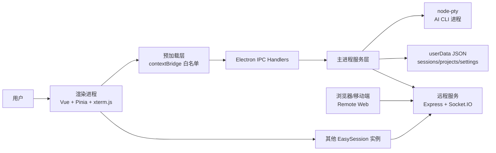
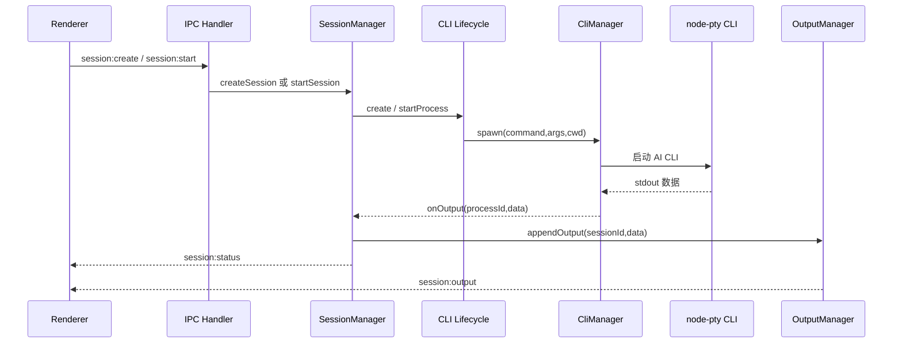
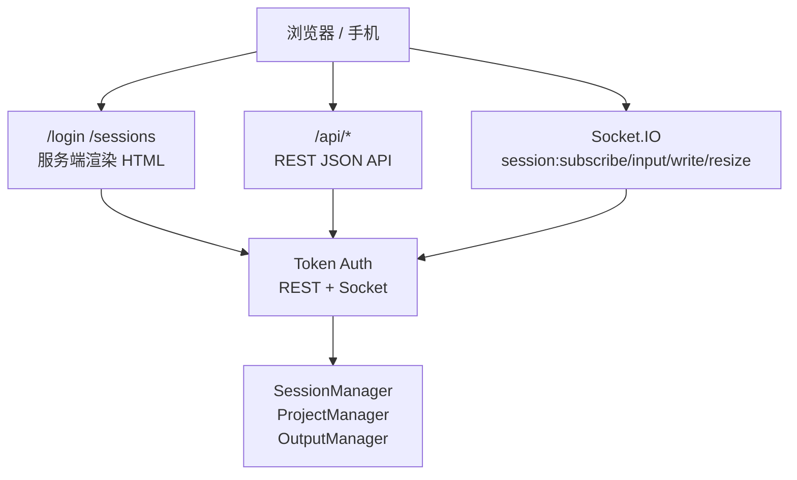

# EasySession 项目架构与演进方案

> 生成日期：2026-06-07  
> 项目路径：`D:\EasySession`  
> 文档目的：给开发者、维护者和后续 AI 助手提供一份可落地的项目全局地图，避免在不了解边界的情况下修改核心逻辑。

## 1. 项目概览

EasySession 是一个基于 Electron 的桌面应用，用于统一管理多个 AI CLI 工具的项目与会话。当前支持 Claude CLI、Codex CLI、OpenCode CLI，并提供桌面端原生终端、远程 Web 访问、远程实例挂载、项目 Git Inspector、Markdown/文本预览、配置与技能管理等能力。

从代码结构看，项目不是单纯的 Electron 壳，而是一个“本地桌面工作台 + 本地远程服务 + 多实例聚合网关”的组合系统：

- 桌面主进程负责 CLI 进程、会话生命周期、项目持久化、IPC、远程服务、Cloudflare Tunnel、远程实例管理。
- 渲染进程负责 Vue 界面、Pinia 状态、工作区布局、终端渲染、项目/会话/设置/Inspector 页面。
- 远程 Web 由主进程内置 Express + Socket.IO 服务提供，可在浏览器或移动端访问。
- 本地和远程资源通过统一资源模型聚合，前端以 `local:<id>` 或 `remoteInstance:<id>` 形式处理全局项目与会话。

当前 `package.json` 版本为 `0.5.0`，README 徽章仍显示 `0.4.1`，这是一个文档一致性问题，不影响运行。

## 2. 技术栈

| 层级 | 技术 | 作用 |
|---|---|---|
| 桌面运行时 | Electron 33 | 主进程、窗口、IPC、打包 |
| 构建 | electron-vite、Vite、TypeScript | 主进程、预加载、渲染进程构建 |
| 前端 | Vue 3.5、Pinia、Vue Router、Vue I18n | 应用 UI、状态管理、路由、多语言 |
| 终端 | xterm.js、node-pty | 原生 CLI 伪终端与终端渲染 |
| 远程服务 | Express、Socket.IO、Helmet、CORS、Pino | REST API、实时终端桥接、安全头和日志 |
| 数据校验与工具 | Zod、dotenv | 配置与运行时辅助 |
| 测试 | Vitest、Playwright | 单元测试、集成测试、E2E |
| 样式 | SCSS | 全局样式、组件样式、设计变量 |

## 3. 代码规模快照

基于 `src`、`tests`、`e2e` 的文件统计：

| 类型 | 数量 |
|---|---:|
| TypeScript | 194 |
| Vue SFC | 43 |
| SCSS | 5 |
| PNG | 2 |
| Markdown | 1 |
| HTML | 1 |

当前较大的核心文件包括：

| 文件 | 约行数 | 说明 |
|---|---:|---|
| `src/main/remote/web/scripts/sessions.ts` | 1367 | 远程 Web 会话页脚本 |
| `src/renderer/src/components/WorkspacePaneTree.vue` | 972 | 多 Pane 工作区树 |
| `src/renderer/src/views/SettingsView.vue` | 943 | 设置页聚合 |
| `src/renderer/src/views/ProjectDetailView.vue` | 940 | 项目详情与工作台 |
| `src/renderer/src/components/TerminalOutput.vue` | 902 | 终端输出渲染 |
| `src/main/services/session-manager.ts` | 497 | 会话生命周期编排 |
| `src/main/services/project-inspector.ts` | 591 | 项目文件与 Git Inspector 服务 |

这些文件是后续重构和风险控制的重点。

## 4. 顶层目录结构

```text
D:\EasySession
├── src/
│   ├── main/                 # Electron 主进程：服务、IPC、远程服务
│   ├── preload/              # contextBridge 安全桥
│   ├── renderer/             # Vue 渲染进程
│   └── remote-web/           # 远程 Web 说明文档
├── tests/                    # Vitest 单元/集成测试
├── e2e/                      # Playwright E2E 测试
├── docs/                     # 项目文档
├── resources/                # 图标、Logo、截图资源
├── release/                  # electron-builder 输出目录
├── out/                      # electron-vite 构建输出
├── node_modules/             # 依赖
├── package.json              # 脚本、依赖、打包配置
├── electron.vite.config.ts   # Electron/Vite 构建配置
├── vitest.config.ts          # 单元测试配置
├── playwright.config.ts      # E2E 测试配置
└── tsconfig*.json            # Node/Web TS 工程配置
```

说明：

- `.trellis/` 目录当前不存在，`trellis start` 在本机返回 `unknown command 'start'`。AGENTS.md 中保留了 Trellis 指引，但当前仓库未提供可执行上下文。
- 工作区存在未跟踪文件，例如 `TODO_REFACTOR_PERFORMANCE.md`、`RELEASE_NOTES_v0.4.8.md`、`.opencode/plans/...` 等，本文件未修改这些内容。

## 5. 总体架构



核心设计思想：

1. 主进程是权威运行时，所有文件系统、CLI、Git、远程服务、持久化操作都在主进程完成。
2. 预加载层只暴露有限 IPC 白名单，降低渲染进程越权调用风险。
3. 渲染进程不直接关心本地或远程差异，而是通过 Gateway 和统一资源模型抽象。
4. CLI 体验优先保持原生，系统不解析成聊天 UI，而是把 PTY 输出完整交给 xterm.js。
5. 远程能力以 Token、REST、Socket、capabilities 组合提供，支持受限的 passthrough-only 模式。

## 6. 主进程架构

主入口：`src/main/index.ts`

主进程在启动时完成以下装配：

- 加载 `.env.local`、`.env`。
- 创建 `CliManager`。
- 创建 Claude/Codex/OpenCode Adapter 和 Session Lifecycle。
- 创建 `SessionManager`、`ProjectManager`、`SkillManager`、`WorkspaceLayoutManager`。
- 初始化远程实例、远程服务、Cloudflare Tunnel、远程网络策略。
- 注册本地 IPC handlers 和远程相关 IPC handlers。
- 在应用退出时执行会话停止、进程清理、配置 watch 清理、持久化 flush。

### 6.1 主进程服务分层

```text
src/main/services/
├── cli-manager.ts                         # node-pty 进程管理
├── session-manager.ts                     # 会话集合、状态、持久化、生命周期编排
├── *-adapter.ts                           # Claude/Codex/OpenCode 命令适配
├── *-session-lifecycle.ts                 # 不同 CLI 的创建/启动/恢复逻辑
├── session-output.ts                      # 会话输出历史、序号、订阅
├── project-manager.ts                     # 项目 CRUD、路径规范化、Prompt 文件
├── project-store.ts                       # 项目持久化
├── project-inspector*.ts                  # 文件树、Git 状态、diff、history、branch、提交操作
├── skill-manager.ts                       # Skill 浏览、预览、执行
├── config-service.ts                      # CLI 配置读写与监听
├── workspace-layout-manager.ts            # 多 Pane 工作区布局持久化
├── remote-instance-manager.ts             # 远程实例列表、Token、连通性
├── remote-gateway-manager.ts              # 桌面端访问远程实例的主进程网关
├── remote-service-manager.ts              # 本机远程服务启停与配置
├── cloudflare-tunnel-manager.ts           # Cloudflare Quick Tunnel 管理
├── remote-network-settings-manager.ts     # 代理/网络策略与 CLI 环境注入
└── data-store.ts                          # 通用 JSON 持久化，带备份与恢复
```

### 6.2 CLI 与会话生命周期

关键对象：

- `CliManager`：封装 `node-pty`，负责 spawn、kill、write、resize、输出广播。
- `SessionManager`：会话状态权威来源，负责 create/start/pause/restart/destroy/list、进程索引、活动时间、运行时统计、持久化。
- `SessionOutputManager`：保存会话输出历史并提供订阅。
- `ClaudeSessionLifecycle`、`CodexSessionLifecycle`、`OpenCodeSessionLifecycle`：处理不同 CLI 的启动参数、恢复逻辑、sessionId 发现、退出清理。

会话启动流程：



重要行为：

- Windows 下 `CliManager` 会解析可执行文件后缀，并为 Claude 注入 Git Bash 路径。
- Windows 下会设置 `PYTHONIOENCODING=utf-8` 和 `FORCE_COLOR=1`。
- `SessionManager` 对持久化使用 200ms 防抖，对活动时间持久化使用 5 秒节流。
- 应用关闭时会等待 `sessionManager.flush()`、`projectManager.flush()`、`workspaceLayoutManager.flush()` 等完成，避免数据丢失。
- OpenCode 退出有 `OPENCODE_EXIT_GRACE_MS` 缓冲，避免退出竞态。

### 6.3 数据持久化

`DataStore<T>` 提供通用 JSON 存储能力：

- 保存前会复制 `.bak` 备份。
- 使用临时文件写入并 `fsync`，再替换目标文件。
- Windows 下遇到 `EEXIST`、`EPERM`、`EBUSY` 会重试或降级写入。
- 主文件损坏时尝试从 `.bak` 恢复。
- JSON 解析错误会记录 line、column、snippet。

主要持久化数据位于 Electron `app.getPath('userData')` 下，典型内容包括：

| 数据 | 管理者 | 说明 |
|---|---|---|
| `sessions.json` | `SessionManager` + `DataStore` | 会话元数据，不保存完整实时进程 |
| 项目列表 | `ProjectStore` | 项目路径、名称、打开时间、路径存在性 |
| 工作区布局 | `WorkspaceLayoutManager` | 多 Pane、Tab、活动 Session 引用 |
| 远程实例 | `RemoteInstanceManager` | 远程地址、状态、Token 引用 |
| 远程服务配置 | `RemoteServiceManager` / settings manager | host、port、token 策略 |
| 网络策略 | `RemoteNetworkSettingsManager` | 代理、Cloudflare、CLI 网络环境策略 |

## 7. IPC 与安全边界

预加载入口：`src/preload/index.ts`

渲染进程只能通过 `window.electronAPI` 调用主进程能力：

- `invoke(channel, ...args)`：只允许 `ALLOWED_INVOKE_CHANNELS` 中的 channel。
- `on(channel, callback)`：只允许 `ALLOWED_RECEIVE_CHANNELS` 中的事件。
- `removeListener(channel, callback)`：只允许移除白名单事件。

这一层是桌面端最重要的安全边界。新增 IPC 时必须同步修改：

1. 主进程 handler。
2. preload 白名单。
3. 渲染进程 API 包装。
4. 单元测试或至少一次调用链验证。

现有 IPC handler 分组：

```text
src/main/ipc/
├── cli-handlers.ts
├── cloudflare-tunnel-handlers.ts
├── config-handlers.ts
├── project-handlers.ts
├── remote-gateway-handlers.ts
├── remote-instance-handlers.ts
├── remote-network-handlers.ts
├── remote-service-handlers.ts
├── session-handlers.ts
├── settings-handlers.ts
├── skill-handlers.ts
├── workspace-handlers.ts
└── index.ts
```

## 8. 渲染进程架构

渲染入口：`src/renderer/src/main.ts`

渲染层使用：

- `App.vue` 作为根组件。
- `router/index.ts` 使用 hash 路由。
- `stores/index.ts` 提供 Pinia。
- `i18n/index.ts` 提供 English / 简体中文。
- `assets/styles/index.scss` 聚合样式。
- `setupGlobalErrorHandler` 注册全局错误处理。

### 8.1 路由

| 路由 | 页面 | 说明 |
|---|---|---|
| `/dashboard` | `DashboardView.vue` | 总览 |
| `/sessions` | `SessionsView.vue` | 会话工作区 |
| `/projects` | `ProjectsView.vue` | 项目列表 |
| `/projects/:id` | `ProjectDetailView.vue` | 本地项目详情 |
| `/instances/:instanceId/projects/:projectId` | `ProjectDetailView.vue` | 远程实例项目详情 |
| `/skills` | `SkillsView.vue` | Skill 浏览 |
| `/settings` | `SettingsView.vue` | 设置 |
| `/config` | redirect | 重定向到 Dashboard advanced panel |

### 8.2 前端目录

```text
src/renderer/src/
├── api/                 # 本地 IPC API 与部分远程/设置 API 包装
├── assets/              # 图片与 SCSS
├── components/          # 通用与业务组件
├── composables/         # Vue 组合函数
├── features/            # session-tree、inspector 等领域逻辑
├── gateways/            # LocalGateway / RemoteGateway / GatewayResolver
├── i18n/                # 多语言
├── layouts/             # MainLayout
├── models/              # 统一资源模型
├── router/              # Vue Router
├── services/            # 渲染侧服务，例如输出流
├── stores/              # Pinia 状态
└── views/               # 页面
```

### 8.3 Store 设计

主要 Pinia store：

| Store | 职责 |
|---|---|
| `sessions.ts` | 本地/远程会话聚合、活动会话、生命周期操作、状态订阅 |
| `projects.ts` | 本地/远程项目聚合、活动项目、项目 CRUD、Prompt 文件 |
| `instances.ts` | 本机实例与远程实例状态、能力、连通性 |
| `workspace.ts` | 多 Pane 工作区布局、Tab、会话引用协调 |
| `settings.ts` | 设置读写与运行时配置 |
| `skills.ts` | Skill 列表、预览、执行 |
| `config.ts` | CLI 配置编辑 |
| `inspector.ts` | Git/file Inspector 状态 |
| `app.ts` | 应用级状态 |

### 8.4 统一资源模型

文件：`src/renderer/src/models/unified-resource.ts`

核心类型：

- `LocalInstance`
- `RemoteInstance`
- `UnifiedProject`
- `UnifiedSession`
- `ProjectRef`
- `SessionRef`
- `InstanceCapabilities`

关键设计：

```text
project.globalProjectKey = `${instanceId}:${projectId}`
session.globalSessionKey = `${instanceId}:${sessionId}`
```

这样本地与远程资源可以进入同一个列表、同一个树、同一个工作区布局，不需要每个 UI 页面重复判断本地/远程。

### 8.5 Gateway 抽象

文件：

- `src/renderer/src/gateways/types.ts`
- `src/renderer/src/gateways/local-gateway.ts`
- `src/renderer/src/gateways/remote-gateway.ts`
- `src/renderer/src/gateways/gateway-resolver.ts`

设计目标：

- `LocalGateway` 通过本地 IPC API 操作本机资源。
- `RemoteGateway` 通过 HTTP + Socket.IO 操作远程 EasySession 服务。
- `GatewayResolver` 根据 `instanceId` 返回对应 Gateway，并缓存远程连接。
- 当远程实例配置变化时，通过 `invalidate()` 清理缓存。

这是桌面端远程挂载能力的核心抽象。

## 9. 远程服务架构

远程服务入口：

- `src/main/services/remote-service-manager.ts`
- `src/main/remote/server.ts`
- `src/main/remote/routes.ts`
- `src/main/remote/socket.ts`
- `src/main/remote/web/*`

### 9.1 服务形态



### 9.2 REST API 能力

当前远程 REST 主要提供：

- 健康检查：`GET /api/health`
- 服务信息：`GET /api/server-info`
- 能力快照：`GET /api/capabilities`
- 项目列表、详情、创建、更新、删除、打开
- 项目会话列表
- 项目 CLI 探测
- 项目 Prompt 文件读写
- 会话列表、创建、启动、暂停、重启、删除
- 会话输出历史读取

### 9.3 Socket.IO 能力

Socket 事件：

| 事件 | 方向 | 说明 |
|---|---|---|
| `session:subscribe` | 客户端到服务端 | 加入会话房间并拉取历史 |
| `session:unsubscribe` | 客户端到服务端 | 退出会话房间 |
| `session:input` | 客户端到服务端 | 输入文本并追加 Enter |
| `session:write` | 客户端到服务端 | 写入原始 PTY 数据 |
| `session:resize` | 客户端到服务端 | 调整终端尺寸 |
| `session:output` | 服务端到客户端 | 推送实时输出 |
| `session:status` | 服务端到客户端 | 推送状态变化 |
| `system:idle-timeout` | 服务端到客户端 | 空闲超时断开 |

### 9.4 远程安全与限制

现有保护：

- REST 和 Socket 均需要 Token。
- REST 有内存限流。
- Express 使用 Helmet，并关闭 `x-powered-by`。
- CORS 开放 origin，适合反代和 Tunnel，但也意味着 Token 保护非常关键。
- 支持 `passthroughOnly`，可禁用创建、启动、暂停、重启、删除等生命周期操作。
- 支持 `X-Forwarded-*` 解析，兼容反向代理和 Cloudflare Tunnel。

建议后续增强：

- Token 存储和展示继续保持“只在需要时取出”的原则。
- 为远程 destructive 操作增加审计日志。
- 对 `/api/projects/:id/prompt` 写操作增加大小限制和备份。
- 为远程 Web 增加更细粒度的 CSRF 或 Origin 策略，至少在非 Tunnel 场景可配置允许域名。

## 10. Project Inspector 架构

核心文件：

- `src/main/services/project-inspector.ts`
- `src/main/services/project-inspector-file.ts`
- `src/main/services/project-inspector-git.ts`
- `src/main/services/project-inspector-git-diff.ts`
- `src/main/services/project-inspector-git-ops.ts`
- `src/main/services/project-inspector-context.ts`
- `src/main/services/project-inspector-shared.ts`

能力：

- 项目文件树。
- 文本、Markdown、二进制、过大文件识别。
- Git status。
- Git diff。
- Git log 和图形泳道数据。
- 分支列表、checkout、fetch、pull、push。
- stage、unstage、discard、commit。
- commit changes 与 commit diff。

重要边界：

- 文件读取通过 `ensureInsideRoot` 防止路径逃逸。
- Git 调用集中在主进程，渲染进程不直接执行命令。
- Git 命令失败会转换为 `non-git`、`git-unavailable`、`error` 等状态。

风险点：

- `discardFile`、`checkoutBranch`、`pullCurrentBranch` 等操作具有破坏性或工作区影响，应确保 UI 有明确确认。
- Git 历史图、远程分支 ahead/behind 解析逻辑复杂，后续修改需要配套测试。
- 文件树和 diff 对大仓库可能存在性能压力，需要分页、缓存或虚拟化策略。

## 11. 工作区布局

核心文件：

- 主进程：`src/main/services/workspace-layout-manager.ts`
- 渲染 store：`src/renderer/src/stores/workspace.ts`
- UI：`src/renderer/src/components/WorkspacePaneTree.vue`

能力：

- 多 Pane 分屏。
- 每个 Pane 可挂载会话 Tab。
- 布局持久化。
- 旧版本布局迁移。
- 会话删除、远程实例离线、远程挂载开关变化时协调 Tab 引用。

设计重点：

- 布局引用的是 `SessionRef`，不是直接持有完整 session。
- `sessionsStore.syncWorkspaceAfterSessionMutation` 会在会话变化后协调布局有效性。
- 远程实例离线时可以保留部分 Tab，避免 UI 状态突然丢失。

## 12. 配置、设置与 Skill

### 12.1 配置

`ConfigService` 和 `config-handlers.ts` 负责 CLI 配置文件读写与监听。支持：

- Claude 全局配置与项目配置。
- Codex 配置。
- OpenCode 配置。
- 配置变更事件 `config:changed`。

### 12.2 设置

设置页聚合多个 section：

- 常规偏好。
- CLI 路径。
- 终端设置。
- 远程服务。
- 远程实例。
- Cloudflare Tunnel。

### 12.3 Skill

`SkillManager` 提供：

- Skill 列表。
- Skill 详情。
- Skill 创建/删除。
- Skill 执行/预览。
- 项目级 Skill 操作。

Skill 与 AI CLI 的项目级约定有关，后续新增 CLI 类型时需要同步考虑 Skill 搜索路径和项目标记文件。

## 13. 构建、运行与测试

### 13.1 NPM 脚本

| 命令 | 说明 |
|---|---|
| `npm run dev` | electron-vite 开发模式 |
| `npm run build` | 构建主进程、预加载、渲染进程 |
| `npm run preview` | electron-vite preview |
| `npm run build:win` | 构建并打 Windows 安装包 |
| `npm run build:dir` | 构建 Windows 目录包 |
| `npm run typecheck` | Web + Node TypeScript 检查 |
| `npm run test` | Vitest |
| `npm run test:e2e` | Playwright |
| `npm run release:verify` | typecheck + test + build |
| `npm run release:win` | release:verify + electron-builder |

### 13.2 测试体系

`tests/` 覆盖范围较广，包含：

- CLI adapter。
- session lifecycle。
- session manager 持久化与退出竞态。
- project manager/store/routing/inspector。
- remote routes、auth、socket、gateway、instance、service。
- settings store、workspace store。
- skill handlers。
- unified resource models。

`e2e/` 覆盖：

- 布局。
- Dashboard。
- Config。
- Sessions。
- Projects。
- Project Detail。
- Orchestration。
- Skills。
- Settings。
- Navigation。
- Keyboard shortcuts。
- Error handling。

建议执行顺序：

```bash
npm run typecheck
npm run test
npm run test:e2e
npm run build
```

文档变更本身通常不需要完整测试，但涉及架构文档引用的代码变更时，优先执行 `typecheck` 和相关测试。

## 14. 关键运行链路

### 14.1 本地桌面创建会话

```text
CreateSessionDialog.vue
  -> sessionsStore.createSessionForInstance(local,...)
  -> LocalGateway.createSession
  -> api/local-session.ts
  -> preload electronAPI.invoke('session:create')
  -> session-handlers.ts
  -> SessionManager.createSession
  -> CLI Lifecycle.create
  -> CliManager.spawn
  -> node-pty
  -> SessionOutputManager / session:status / session:output
  -> TerminalOutput.vue
```

### 14.2 桌面挂载远程实例

```text
SettingsView / RemoteInstancesSettingsSection
  -> instancesStore.addRemoteInstance / testRemoteInstance
  -> remote-instance IPC
  -> RemoteInstanceManager
  -> RemoteGateway / RemoteGatewayManager
  -> 远程 EasySession /api/server-info /api/capabilities
  -> projectsStore.fetchProjectsForInstance
  -> sessionsStore.fetchSessionsForInstance
  -> UnifiedProject / UnifiedSession
  -> UI 聚合显示
```

### 14.3 浏览器远程控制会话

```text
Browser /sessions
  -> renderSessionsPage
  -> sessionsScript + terminalScript
  -> REST Token 登录
  -> GET /api/projects /api/sessions
  -> Socket session:subscribe
  -> SessionOutputManager.subscribe
  -> Socket session:output
  -> xterm.js 渲染
  -> Socket session:write / session:resize
  -> SessionManager.writeRaw / resizeTerminal
```

### 14.4 项目 Git Inspector

```text
ProjectDetailView / InspectorPanel
  -> inspector store / project API
  -> project IPC
  -> ProjectInspectorService
  -> resolveProjectInspectorTarget
  -> resolveProjectGitContext
  -> git status/log/diff/branch 或文件读取
  -> 返回结构化结果
  -> DiffViewer / GitChangesTree / GitHistoryTree / TextFileViewer
```

## 15. 当前架构优势

1. 主进程集中掌握副作用，安全边界清晰。
2. 统一资源模型解决了本地/远程多实例聚合问题。
3. 会话生命周期按 CLI 类型拆分，便于新增 Gemini 等 CLI。
4. 远程服务 REST 与 Socket 职责清楚，浏览器端和桌面远程挂载都可复用。
5. 持久化有备份和恢复机制，适合桌面应用长期使用。
6. 测试覆盖面较广，尤其是远程、会话、项目和 store 层。
7. IPC 白名单降低渲染进程误调用主进程敏感能力的风险。

## 16. 主要风险与技术债

| 风险 | 位置 | 影响 | 建议 |
|---|---|---|---|
| 大文件过长 | remote web scripts、SettingsView、ProjectDetailView、WorkspacePaneTree、TerminalOutput | 修改成本高，回归风险大 | 按领域拆分 composable、子组件、纯函数模块 |
| 远程 Web 脚本为字符串模板 | `src/main/remote/web/scripts/*.ts` | 缺少前端构建校验和类型保护 | 中期考虑独立 remote-web Vite 子应用或至少抽离可测试逻辑 |
| README 与 package 版本不一致 | README badge vs `package.json` | 发布信息混乱 | 发布流程中自动同步版本 |
| 远程 CORS 较开放 | `src/main/remote/server.ts` | Token 泄漏时影响扩大 | 增加可配置 allowed origins |
| Git destructive 操作风险 | `project-inspector-git-ops.ts` | 可能丢失未保存变更 | UI 二次确认、操作前状态快照、测试覆盖 |
| 多 store 互相调用 | projects/sessions/workspace/instances | 隐式耦合增加 | 为跨 store 协调建立领域服务或事件层 |
| Windows 优先设计 | README Roadmap 标注 macOS/Linux 未完成 | 跨平台能力不足 | 抽象 shell/路径/PTY 差异，增加平台测试 |
| IPC channel 手动维护 | preload + handlers + api | 新增能力易漏白名单或测试 | 增加 IPC channel registry 或测试白名单一致性 |

## 17. 演进方案

### 阶段一：稳定性与文档基线

目标：降低维护门槛，修正明显一致性问题。

- 建立本文档为架构入口，并在 README 开发章节链接。
- 同步 README badge 版本与 `package.json`。
- 补充“新增 IPC 的 checklist”到开发文档。
- 为远程 destructive 操作补充 UI 确认文案与测试。
- 为 `trellis start` 不可用的问题确认工具链状态，避免后续助手误以为存在 `.trellis/` 上下文。

### 阶段二：拆分高复杂度前端模块

目标：降低 UI 修改回归风险。

建议顺序：

1. `SettingsView.vue` 按远程服务、远程实例、CLI 路径、终端设置继续下沉 section，保留页面只做组合。
2. `ProjectDetailView.vue` 把项目头部、会话创建、Prompt 编辑、Inspector 编排拆为 composables。
3. `TerminalOutput.vue` 把 xterm 生命周期、输出订阅、resize、输入写入拆分。
4. `WorkspacePaneTree.vue` 把树构建、拖拽/切分、Tab 操作与展示分离。

验收标准：

- 单个 Vue 文件尽量控制在 400 行以内。
- 纯状态/算法逻辑迁入 `features/` 或 `composables/`，配套 Vitest。
- UI 拆分不改变用户可见行为。

### 阶段三：远程 Web 工程化

目标：让远程 Web 具备类型检查、构建优化和更好的可维护性。

可选方案：

| 方案 | 优点 | 缺点 |
|---|---|---|
| 保持模板字符串，拆纯函数与测试 | 改动小，风险低 | 长期仍缺少前端构建体验 |
| 建立独立 Vite remote-web 子应用 | 类型、构建、样式、测试完整 | 打包和资源路径需要重新设计 |
| 复用 renderer 部分组件 | 视觉一致性高 | Electron API 与浏览器环境差异较大 |

推荐先做“小步拆分”，把 `sessions.ts` 中可测试的状态机、Socket 封装、终端绑定抽成普通 TS 模块；等远程 Web 功能继续扩大时，再升级为独立构建目标。

### 阶段四：CLI 插件化

目标：为 Gemini CLI 等新增工具降低成本。

当前新增 CLI 至少需要改：

- `CliType` 类型。
- `types.ts` session options。
- Adapter。
- Session Lifecycle。
- `SessionManager.lifecycles`。
- 前端创建会话 UI。
- 项目探测逻辑。
- Prompt 文件约定。
- Skill 路径。
- 测试。

建议引入 `CliProvider` 注册表：

```ts
interface CliProvider {
  type: string
  displayName: string
  adapter: CliAdapter
  lifecycle: ISessionLifecycle
  detectProject(path: string): Promise<boolean>
  promptCandidates(path: string): string[]
  defaultIcon: string | null
}
```

短期先整理 checklist；中期再重构为注册表，避免过早抽象影响现有稳定性。

### 阶段五：安全与远程治理

目标：让远程访问适合更真实的长期使用。

- 增加远程服务 allowed origins 配置。
- 增加远程操作审计日志。
- 对会话 input/write 增加可配置速率限制。
- Token 轮换后主动断开旧 Socket。
- 对 Cloudflare Tunnel 失败分类增加用户可读恢复建议。
- 对 passthrough-only 模式在 UI 层明确禁用按钮和原因。

## 18. 修改代码时的建议边界

### 会话相关

优先阅读：

- `session-manager.ts`
- 对应 CLI 的 `*-session-lifecycle.ts`
- `cli-manager.ts`
- `session-output.ts`
- `tests/*session*.test.ts`

注意：

- 不要绕过 `SessionManager` 直接操作 `CliManager` 进程。
- 状态变化必须考虑 `session:status` 广播和持久化。
- 输出写入必须考虑本地 UI 和远程 Socket 订阅。

### 项目相关

优先阅读：

- `project-manager.ts`
- `project-store.ts`
- `project-handlers.ts`
- `projects.ts` store
- `tests/project*.test.ts`

注意：

- 项目路径需要 normalize，并在 Windows 下大小写归一。
- 删除项目会联动销毁项目会话。
- Prompt 文件读写必须按 CLI 类型处理。

### 远程相关

优先阅读：

- `remote/server.ts`
- `remote/routes.ts`
- `remote/socket.ts`
- `remote-instance-manager.ts`
- `remote-gateway-manager.ts`
- `renderer/src/gateways/remote-gateway.ts`
- `tests/remote*.test.ts`

注意：

- REST 和 Socket 的认证逻辑要一致。
- 新增远程能力时要同步 capabilities。
- 桌面远程挂载和浏览器 remote web 可能都会受影响。

### Inspector 相关

优先阅读：

- `project-inspector.ts`
- `project-inspector-git-ops.ts`
- `project-inspector-file.ts`
- `InspectorPanel.vue`
- `GitChangesTree.vue`
- `GitHistoryTree.vue`

注意：

- 文件路径必须限制在项目根内。
- Git 写操作需要 UI 确认和测试。
- diff、history、branch 解析变更要增加样例测试。

## 19. 建议新增的文档

后续可以继续补充：

```text
docs/
├── PROJECT_ARCHITECTURE.zh-CN.md       # 本文档
├── IPC_CONTRACT.zh-CN.md               # IPC channel、参数、返回值、权限
├── REMOTE_API.zh-CN.md                 # 远程 REST / Socket 协议
├── SESSION_LIFECYCLE.zh-CN.md          # 会话生命周期细节
├── CLI_PROVIDER_GUIDE.zh-CN.md         # 新增 CLI 接入指南
└── RELEASE_PROCESS.zh-CN.md            # 版本、测试、打包、发布流程
```

## 20. 总结

EasySession 当前架构的核心价值在于把本地 CLI 原生体验、桌面多会话管理、远程 Web 访问和多实例挂载统一到了一个产品模型里。主进程服务层和统一资源模型是整个系统的骨架，`SessionManager`、`CliManager`、`ProjectManager`、`RemoteGatewayServer`、`GatewayResolver`、`workspace` store 是最需要谨慎维护的关键节点。

后续演进应以“先固化边界，再拆复杂文件，最后抽象插件化”为主线。短期不要大幅改动会话核心和远程桥接协议；中期优先降低大组件与远程 Web 模板脚本的复杂度；长期再考虑 CLI Provider 注册表和独立 remote-web 构建目标。
