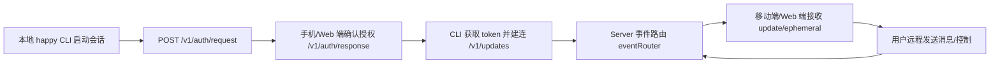
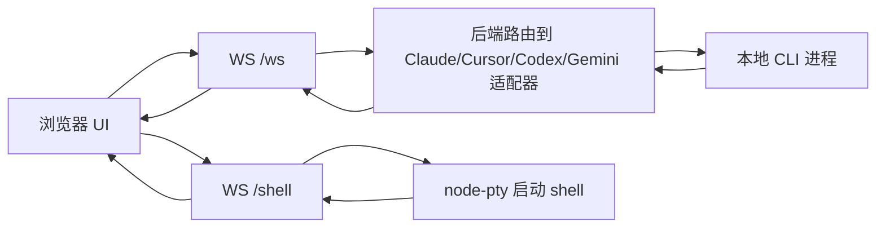
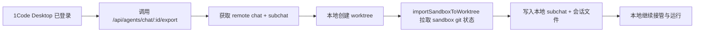
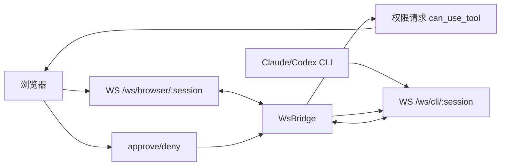
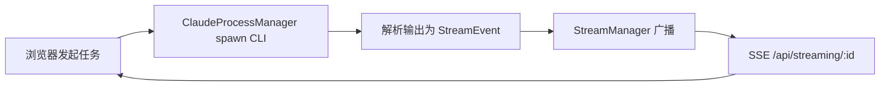
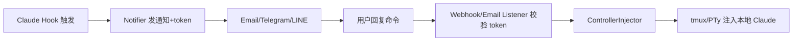
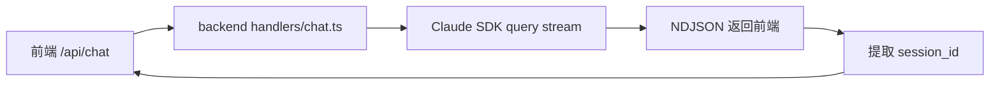
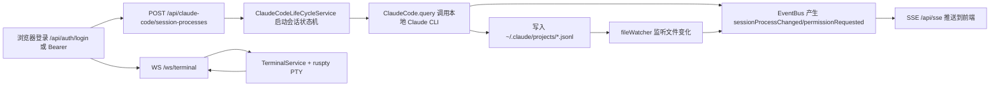
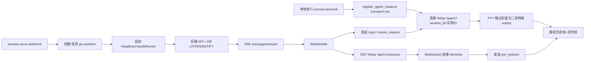

# 远程操控本地 CLI 项目调研（进行中）

更新时间：2026-03-04  
说明：先落盘已完成的仓库分析，避免上下文丢失。剩余仓库将继续补全。

---

## 1) slopus/happy

### 框架与架构
- Monorepo（Yarn workspace）
- 组件：`happy-app`（Web/移动端）、`happy-cli`、`happy-server`、`happy-agent`、`happy-wire`
- 后端：Fastify + Socket.IO + Prisma
- CLI：Node/TS，封装 Claude/Codex，带 daemon

### 如何实现远程操作
- 本地 `happy` CLI 启动会话并上报 `happy-server`
- 设备之间通过 `Socket.IO` 同步会话事件（update/ephemeral）
- 服务端维护 `session-scoped / user-scoped / machine-scoped` 连接模型
- 认证流程为终端请求授权 + 移动端确认（`/v1/auth/request` + `/v1/auth/response`）
- 协议层文档明确为“加密 payload + WebSocket 事件流”

### 核心代码位置
- `packages/happy-server/sources/app/api/socket.ts`
- `packages/happy-server/sources/app/events/eventRouter.ts`
- `packages/happy-server/sources/app/api/routes/authRoutes.ts`
- `packages/happy-cli/src/claude/runClaude.ts`
- `docs/session-protocol.md`

### 远程流程图


### 操作方式（常见）
- 安装后使用 `happy` 替代 `claude`
- 使用 `happy codex` 替代 `codex`
- 首次完成 auth 绑定后，可在手机/Web 接管

---

## 2) siteboon/claudecodeui（CloudCLI UI）

### 框架与架构
- 前端：React + Vite + xterm
- 后端：Express + `ws` + `node-pty`
- 多 CLI 适配：Claude / Cursor / Codex / Gemini
- 本地模式与 Cloud 模式并存（CloudCLI Cloud 为托管形态）

### 如何实现远程操作
- 浏览器通过 WebSocket 连后端（`/ws` 聊天、`/shell` 终端）
- 后端按消息类型把请求路由到不同 CLI 适配器
- 终端侧用 `node-pty` 起 shell，把输入输出通过 WebSocket 回传
- 会话可恢复（`sessionId` + resume 逻辑）
- 身份鉴权使用 JWT（单用户模型），API 受 `authenticateToken` 保护

### 核心代码位置
- `server/index.js`（WebSocket、API、PTY 主逻辑）
- `server/middleware/auth.js`（JWT + API key）
- `server/routes/auth.js`（注册/登录）
- `server/claude-sdk.js`
- `server/cursor-cli.js`
- `server/openai-codex.js`

### 远程流程图


### 操作方式（常见）
- `npm install -g @siteboon/claude-code-ui`
- `cloudcli`（默认端口 3001，可 `-p` 改端口）
- 浏览器访问 `http://localhost:3001`

---

## 3) 21st-dev/1code

### 框架与架构
- 桌面端：Electron + React + tRPC（`trpc-electron`）
- 数据层：SQLite（Drizzle）
- 终端能力：`node-pty`
- Agent 执行：Claude SDK + Codex ACP 适配
- 支持本地 worktree 与云 sandbox 相关能力

### 如何实现远程操作
- 本地桌面应用中通过 tRPC 组织主进程与渲染进程通信
- 本地模式：每个会话绑定独立 worktree + 本地 agent 流式输出
- 云/远端相关：通过 `sandbox-import` 路由调用 `21st.dev` API 拉取远端 chat/sandbox 导回本地
- 认证走 desktop OAuth（`/api/auth/desktop/exchange/refresh`），token 加密存储

### 核心代码位置
- `src/main/lib/trpc/routers/claude.ts`
- `src/main/lib/trpc/routers/codex.ts`
- `src/main/lib/trpc/routers/terminal.ts`
- `src/main/lib/trpc/routers/sandbox-import.ts`
- `src/main/auth-manager.ts`

### 远程流程图（远端导回本地）


### 操作方式（常见）
- `bun install`
- `bun run dev`
- 首次需下载二进制：`bun run claude:download`、`bun run codex:download`

---

## 4) The-Vibe-Company/companion

### 框架与架构
- 前后端同仓（`web/`）
- 后端：Bun + Hono + `ws`
- 核心组件：`CliLauncher` + `WsBridge` + `SessionStore`
- 支持 Claude/Codex，多会话与权限审批流

### 如何实现远程操作
- 浏览器连 `ws://.../ws/browser/:session`
- 启动 CLI 时附带 `--sdk-url ws://.../ws/cli/:session`
- `WsBridge` 在 CLI socket 与浏览器 socket 间做协议翻译和会话状态管理
- 工具权限请求走 `control_request(can_use_tool)`，UI 决策后回 `control_response`
- token 鉴权由 `auth-manager` 负责，默认保存在 `~/.companion/auth.json`

### 核心代码位置
- `web/server/index.ts`
- `web/server/ws-bridge.ts`
- `web/server/cli-launcher.ts`
- `web/server/auth-manager.ts`

### 远程流程图


### 操作方式（常见）
- 快速：`bunx the-companion`
- 安装服务：`the-companion install && the-companion start`
- 访问：`http://localhost:3456`

---

## 5) wbopan/cui

### 框架与架构
- 后端：Express + SSE（`text/event-stream`）
- 前端：React（Vite）
- 进程执行：`ClaudeProcessManager` 管理 Claude CLI 子进程
- 流管理：`StreamManager` 负责多客户端广播
- 认证：Bearer Token 中间件（可 CLI 覆盖 token）

### 如何实现远程操作
- 前端发起会话请求，后端 spawn Claude CLI
- Claude 输出被解析成事件后广播到对应 `streamingId`
- 客户端通过 `/api/streaming/:streamingId` 建立 SSE 持续接收
- 可多任务并行，页面关闭后任务可继续运行

### 核心代码位置
- `src/cui-server.ts`
- `src/services/claude-process-manager.ts`
- `src/services/stream-manager.ts`
- `src/routes/streaming.routes.ts`
- `src/middleware/auth.ts`
- 文档：`docs/README.md`

### 远程流程图


### 操作方式（常见）
- `npx cui-server`
- 浏览器打开 `http://localhost:3001/#<token>`
- 远程访问时需配置 `host/port` 与安全 token（建议反代 HTTPS）

---

## 6) JessyTsui/Claude-Code-Remote

### 框架与架构
- Node.js + Express
- 通道：Email（SMTP/IMAP）、Telegram、LINE、Desktop
- 命令注入：tmux 或 PTY（`ControllerInjector`）
- 触发：Claude hooks 触发通知，远端回复后注入本地会话

### 如何实现远程操作
- 本地 Claude 任务完成/等待时触发 `claude-hook-notify.js`
- 系统生成 session token，向邮件/Telegram/LINE 推送通知
- 用户用 token 回发命令（如 `/cmd TOKEN your command`）
- Webhook/邮件监听器解析命令并校验 token
- 通过 tmux send-keys 或 PTY 写入命令注入本地 Claude 会话

### 核心代码位置
- `claude-remote.js`
- `src/core/notifier.js`
- `src/channels/telegram/webhook.js`
- `src/relay/email-listener.js`
- `src/utils/controller-injector.js`

### 远程流程图


### 操作方式（常见）
- `npm install`
- 配置 `.env`（SMTP/IMAP、Telegram/LINE token、SESSION_MAP_PATH）
- 启动：`node claude-remote.js daemon start` 或 `npm run telegram` / `npm run line`

---

## 7) sugyan/claude-code-webui

### 框架与架构
- 后端：Hono（Deno/Node 双运行时）
- 前端：React + Vite
- 对 Claude Code SDK 的封装：`query()` 流式返回 NDJSON
- 会话连续性：`session_id` + `resume`

### 如何实现远程操作
- 前端调用 `POST /api/chat`，后端执行 SDK `query()`
- 后端将 SDK 消息包装为 NDJSON 流返回前端
- 前端拿到 `session_id` 后，后续请求继续带 `sessionId` 实现会话恢复
- 项目定位是本地优先，README 明确提示默认无内建认证

### 核心代码位置
- `backend/app.ts`
- `backend/handlers/chat.ts`
- `backend/handlers/histories.ts`
- `backend/middleware/config.ts`

### 远程流程图


### 操作方式（常见）
- `npm install -g claude-code-webui`
- `claude-code-webui --port 8080`
- 访问 `http://localhost:8080`

---

## 8) d-kimuson/claude-code-viewer

### 框架与架构
- 前后端同仓：React + Vite（前端）+ Hono（后端）
- 服务分层：`Effect` + `Layer` 进行依赖注入（Infrastructure / Domain / Presentation）
- Claude 执行层：`@anthropic-ai/claude-agent-sdk` + 本机 Claude CLI
- 实时通道：SSE（业务事件）+ WebSocket（内置终端）
- 终端实现：`@replit/ruspty` 管理 PTY 会话与多客户端复用

### 如何实现远程操作
- 启动时支持 `--hostname`、`--password`、`--api-only`，可将服务绑定到远程可访问地址
- 认证支持两种模式：登录后 `ccv-session` Cookie，或 `Authorization: Bearer <password>`
- 前端通过 `POST /api/claude-code/session-processes` 创建会话进程，后端调用 SDK `query()` 驱动 Claude
- Claude 流式消息驱动状态机（pending -> initialized -> paused/completed），并通过 `EventBus` 触发 UI 刷新事件
- 文件变更监听 `~/.claude/projects`，将 session 文件更新映射成 `sessionChanged/sessionListChanged` 再推送到 SSE
- 终端面板走 `/ws/terminal`，支持输入、resize、信号、断线后 `sync` 补帧

### 核心代码位置
- `src/server/main.ts`
- `src/server/startServer.ts`
- `src/server/hono/routes/index.ts`
- `src/server/hono/middleware/auth.middleware.ts`
- `src/server/hono/routes/claudeCodeRoutes.ts`
- `src/server/core/claude-code/services/ClaudeCodeLifeCycleService.ts`
- `src/server/core/claude-code/models/ClaudeCode.ts`
- `src/server/hono/routes/sseRoutes.ts`
- `src/server/core/events/presentation/SSEController.ts`
- `src/server/core/events/services/fileWatcher.ts`
- `src/server/terminal/terminalWebSocket.ts`
- `src/server/core/terminal/TerminalService.ts`

### 远程流程图


### 操作方式（常见）
- 快速启动：`npx @kimuson/claude-code-viewer@latest --port 3400`
- 远程访问：`npx @kimuson/claude-code-viewer@latest --hostname 0.0.0.0 --port 3400 --password <你的密码>`
- API-only：`npx @kimuson/claude-code-viewer@latest --api-only --password <你的密码>`
- 默认访问：`http://localhost:3400`

---

## 9) BloopAI/vibe-kanban

### 框架与架构
- 核心后端：Rust + Axum（`crates/server`）
- 执行层：`crates/services` + `crates/local-deployment` + `crates/executors`
- 前端：本地 Web UI（`packages/local-web`）+ 共享 UI 核心（`packages/web-core`）
- 多代理适配：Claude/Codex/Gemini/Cursor/Amp/OpenCode 等统一到 `StandardCodingAgentExecutor`
- 实时通道：SSE（全局事件）+ WebSocket（执行日志、审批流、终端）
- 远程接入：可选 Relay Tunnel（签名请求 + 签名 WebSocket 帧）

### 如何实现远程操作
- 前端创建或继续会话后，请求 `/api/sessions/:session_id/follow-up` 触发执行
- `ContainerService.start_execution` 建立 execution_process，`start_execution_inner` 真正 spawn 本地 agent CLI 进程
- 执行日志进入 `MsgStore`，通过 `/api/execution-processes/:id/raw-logs/ws` 或 `.../normalized-logs/ws` 实时推送
- 全局状态变化（workspace/execution/scratch）经 DB hook 写入事件流，前端走 `/api/events`(SSE) 订阅
- 工具审批走 `/api/approvals/stream/ws` + `/api/approvals/{id}/respond`
- 终端远控走 `/api/terminal/ws`，后端 PTY 服务负责输入输出和窗口 resize
- 开启 relay 后，本地服务会向 relay 服务发起连接；远程请求需签名校验，WebSocket 帧也逐帧签名验签

### 核心代码位置
- `crates/server/src/main.rs`
- `crates/server/src/routes/mod.rs`
- `crates/server/src/routes/sessions/mod.rs`
- `crates/server/src/routes/execution_processes.rs`
- `crates/server/src/routes/events.rs`
- `crates/server/src/routes/approvals.rs`
- `crates/server/src/routes/terminal.rs`
- `crates/services/src/services/container.rs`
- `crates/local-deployment/src/container.rs`
- `crates/local-deployment/src/pty.rs`
- `crates/executors/src/executors/mod.rs`
- `crates/executors/src/executors/claude/client.rs`
- `crates/executors/src/executors/acp/harness.rs`
- `crates/server/src/tunnel.rs`
- `crates/server/src/routes/relay_auth.rs`
- `crates/server/src/routes/relay_ws.rs`

### 远程流程图
```mermaid
flowchart LR
  A[Web UI 创建/继续会话] --> B[/api/sessions/:id/follow-up]
  B --> C[ContainerService.start_execution]
  C --> D[LocalContainerService.start_execution_inner]
  D --> E[Spawn 本地 Claude/Codex/Gemini 等 CLI]
  E --> F[MsgStore 累积日志与补丁]
  F --> G[/api/execution-processes/*/ws]
  E --> H[审批请求]
  H --> I[/api/approvals/stream/ws + respond]
  J[DB Hook 事件] --> K[/api/events SSE]
  A --> L[/api/terminal/ws]
  L --> M[PtyService]
  N[可选 Relay Tunnel] --> O[签名 HTTP/WS 转发到本地 API]
```

### 操作方式（常见）
- 本地启动：`npx vibe-kanban`
- 远程反代场景：设置 `VK_ALLOWED_ORIGINS=https://你的域名`
- 自建共享/远程模式：配置 `VK_SHARED_API_BASE`（共享 API）与 `VK_SHARED_RELAY_API_BASE`（Relay）
- 启用隧道：设置 `VK_TUNNEL=1`（并配置 relay base）

---

## 10) sunpix/claude-code-web

### 框架与架构
- GitHub 仓库本体几乎只有 README/CHANGELOG（源码未直接公开）
- 实际实现可从 npm 包获取：Nuxt 4 + Nitro（SSR 关闭，SPA + Node 服务）
- Claude 接入：`@anthropic-ai/claude-code` 的 `query()` 直接驱动本机 Claude CLI
- 交互通道：WebSocket（`/_ws`）为核心，REST API 辅助（项目/会话/设置）
- 文件监听：`chokidar` 监听 `~/.claude/projects` 目录变化并推送前端

### 如何实现远程操作
- 浏览器通过 `/_ws` 发送 `chat/reconnect-session/abort-session/watch-session/ping`
- `chat` 消息会调用 `query({ prompt, options })`，支持 `resume/sessionId/cwd/permissionMode` 等参数
- 服务端维护会话状态表（busy/projectId/startTime/lastActivity），并把 Claude 流式消息推给当前会话观察者
- 支持会话中断（abortController）与会话重连（`/api/sessions/:sessionId/status` + WS reconnect）
- 通过 chokidar 监听项目与 `*.jsonl` 会话文件变化，广播 `project-change/session-*` 事件
- REST 侧主要负责项目发现、会话列表、消息读取、项目设置读写；部分接口仍是 `501 Not Implemented`
- README 明确“无认证”，暴露端口即可远程控制本机环境

### 核心代码位置
- GitHub（说明层）：
  - `README.md`
  - `CHANGELOG.md`
- npm 包（`@sunpix/claude-code-web@1.2.2`）：
  - `bin/claude-code-web.js`
  - `.output/server/chunks/nitro/nitro.mjs`（核心运行时、WS 会话管理、项目扫描）
  - `.output/server/chunks/routes/api/projects.get.mjs`
  - `.output/server/chunks/routes/api/projects.post.mjs`
  - `.output/server/chunks/routes/api/projects.put.mjs`
  - `.output/server/chunks/routes/api/projects.delete.mjs`
  - `.output/server/chunks/routes/api/sessions/_sessionId/status.get.mjs`
  - `.output/server/chunks/routes/api/project-settings.get.mjs`
  - `.output/server/chunks/routes/api/project-settings.post.mjs`
  - `.output/server/chunks/routes/api/whisper.post.mjs`
  - `.output/server/chunks/routes/api/speech.get.mjs`

### 远程流程图
```mermaid
flowchart LR
  A[浏览器连接 /_ws] --> B[发送 type=chat]
  B --> C[服务端 query() 调用本地 Claude CLI]
  C --> D[流式消息写入会话状态映射]
  D --> E[推送 claude-response 到当前会话观察者]
  A --> F[/api/projects + /api/sessions/* 状态接口]
  G[chokidar 监听 ~/.claude/projects/*.jsonl] --> H[广播 project-change/session-*]
  H --> A
```

### 操作方式（常见）
- 安装：`npm install -g @sunpix/claude-code-web`
- 启动：`claude-code-web`
- 改端口：`PORT=8080 claude-code-web`
- 子路径反代：`APP_BASE_URL=/claude-code claude-code-web`
- 语音能力：`OPENAI_API_KEY=sk-... claude-code-web`
- 安全建议：必须放到防火墙或反向代理鉴权后使用

## 11) omnara-ai/omnara（已停止维护）

### 框架与架构
- monorepo 结构：Python 后端/CLI + Web(React) + Mobile(React Native)。
- CLI 入口：`src/omnara/cli.py`，支持 `omnara`、`omnara terminal`、`omnara headless`、`omnara serve`、`omnara mcp`。
- 终端远控数据面：独立 relay 服务（FastAPI）`src/relay_server/*`。
- 会话消息/状态面：API + SSE（`/api/v1/agent-instances/:id/messages/stream`）。
- README 顶部明确该仓库“旧版已停止维护”，并迁移到新平台；这是围绕 Claude Code CLI 包装层的历史版本。

### 如何实现远程操作
- 本地 CLI 启动时，`session_sharing.py` 会：
  - 先向 API 注册 agent instance（`transport=ws`），
  - 再用 API Key 连接 relay 的 `/agent?session_id=...`，
  - 将本地 PTY 输出封装成二进制帧（output/input/resize/metadata）双向转发。
- Web/Mobile 端先请求 relay 的 `/api/v1/sessions` 找会话，再连 `/terminal`：
  - 发送 `join_session` 加入会话，
  - 收到历史输出帧回放 + 实时输出帧，
  - 用户输入以 `input` 回传，窗口变化以 `resize_request` 回传。
- 聊天/状态侧（非终端字节流）通过后端 SSE：
  - agent 消息、status_update、message_update、git_diff_update、agent_heartbeat。
- 远程启动能力由 `omnara serve` 提供：
  - 本地起 webhook 服务（可选 Cloudflare Tunnel），
  - 仪表盘/外部调用 webhook 后在本机创建 git worktree，
  - 启动 headless Claude Runner（Claude SDK + Omnara MCP）在后台执行。

### 核心代码位置
- CLI 与本地会话桥接：
  - `src/omnara/cli.py`
  - `src/omnara/commands/run.py`
  - `src/omnara/session_sharing.py`
  - `src/omnara/agents/codex.py`
- Relay 服务：
  - `src/relay_server/app.py`
  - `src/relay_server/routes.py`
  - `src/relay_server/sessions.py`
  - `src/relay_server/protocol.py`
  - `src/relay_server/auth.py`
- API 与 SSE：
  - `src/servers/api/routers.py`（agent instance 注册、message/user message、heartbeat、end session）
  - `src/backend/api/agents.py`（`messages/stream` SSE）
- 前端远控终端：
  - `apps/web/src/lib/relayClient.ts`
  - `apps/web/src/components/dashboard/instances/TerminalLiveTerminal.tsx`
  - `apps/mobile/src/components/terminal/TerminalMobileTerminal.tsx`
  - `apps/mobile/src/hooks/useSSE.ts`
- 远程启动（webhook/headless）：
  - `src/integrations/webhooks/claude_code/claude_code.py`
  - `src/integrations/headless/claude_code.py`

### 远程流程图


### 操作方式（常见）
- 终端镜像（推荐链路）：`omnara terminal --agent claude` 或 `omnara terminal --agent codex`
- 默认本地直跑（legacy）：`omnara`（走本地 agent 启动，不经 relay）
- 仪表盘专用无终端：`omnara headless`
- 远程启动入口：`omnara serve`（可选 `--no-tunnel`）
- 指定 relay：`omnara terminal --relay-url ws://localhost:8787/agent`
- 说明：README 标注旧版服务“持续到 2025-12-31”。当前日期是 `2026-03-04`，若在线服务不可用属于预期，优先参考自托管源码能力。

---
## 12) cablate/Claude-Code-Board（已停止维护）

### 框架与架构
- 前后端分离：Backend（Node.js + Express + Socket.IO + SQLite）+ Frontend（React + Vite + Socket.IO Client）。
- 会话模型：后端 `sessions/messages` 入库，前端先走 REST 拉历史，再用 WebSocket 收实时流。
- Claude 执行层：`ProcessManager` 调 `npx -y @anthropic-ai/claude-code@latest`，以 `--output-format=stream-json` 解析结构化输出。
- 串流解析核心：`UnifiedStreamProcessor`，统一处理 `assistant/user/system/tool_use` 等消息并落库+推送。
- README 顶部明确仓库已停更（archived，不再维护）；最近提交也是停更公告样式更新（`2026-01-28`）。

### 如何实现远程操作
- 用户在 Web 登录后（JWT），调用 `/api/sessions` 创建本地会话；若带初始任务，会异步触发一次 Claude 执行。
- 发消息走 `/api/sessions/:sessionId/messages`：
  - 后端保存 user 消息，
  - 按会话状态组装 Claude 命令（新会话 / `--continue` / `--resume=<claudeSessionId>`），
  - 将 prompt 写入子进程 stdin，实时读取 stream-json。
- `UnifiedStreamProcessor` 将 Claude 输出拆成消息事件：
  - 一边写 SQLite（消息、元数据、状态），
  - 一边通过 Socket.IO 发到 `session:{id}` 房间。
- 前端通过 `subscribe(sessionId)` 加入房间，接收 `message/status_update/process_exit/error` 等事件，形成实时对话界面。
- 支持中断 `/interrupt`、恢复 `/resume`、标记完成 `/complete`，并维护 session 状态机（processing/idle/completed/error）。
- 安全层仅基础 JWT 与本地部署假设；README 明确不建议公网部署。

### 核心代码位置
- 后端入口与事件总线：
  - `backend/src/server.ts`
  - `backend/src/routes/session.routes.ts`
  - `backend/src/controllers/SessionController.ts`
- 会话与 Claude 执行：
  - `backend/src/services/SessionService.ts`
  - `backend/src/services/ProcessManager.ts`
  - `backend/src/services/UnifiedStreamProcessor.ts`
- 持久化：
  - `backend/src/database/database.ts`
  - `backend/src/repositories/SessionRepository.ts`
  - `backend/src/repositories/MessageRepository.ts`
- 认证与配置：
  - `backend/src/routes/auth.routes.ts`
  - `backend/src/middleware/auth.middleware.ts`
  - `backend/src/config/env.config.ts`
- 前端远程交互：
  - `frontend/src/services/api.ts`
  - `frontend/src/services/websocket.ts`
  - `frontend/src/hooks/useWebSocket.ts`
  - `frontend/src/components/Session/ChatInterface.tsx`
  - `frontend/src/components/Session/SessionDetail.tsx`

### 远程流程图
```mermaid
flowchart LR
  A[浏览器登录 JWT] --> B[POST /api/sessions 创建会话]
  B --> C[ProcessManager.startClaudeProcess]
  C --> D[npx claude-code --output-format=stream-json]
  D --> E[UnifiedStreamProcessor 解析流]
  E --> F[SQLite 落库 sessions/messages]
  E --> G[Socket.IO 推送 session:{id}]

  H[前端 subscribe(sessionId)] --> G
  I[前端 POST /api/sessions/:id/messages] --> C
  J[前端 POST /interrupt 或 /complete] --> C
```

### 操作方式（常见）
- 安装依赖：根目录、`backend/`、`frontend/` 分别 `npm install`
- 启动：Windows 可用 `start.bat`，或分别执行 `npm run dev:backend` + `npm run dev:frontend`
- 默认端口以 `.env` 为准（示例：后端 `8905`，前端 Vite `5173`）
- 登录默认值（若未改环境变量）：`ADMIN_USERNAME=admin`、`ADMIN_PASSWORD=admin`
- 会话内可继续同一 Claude 对话（依赖 `claude_session_id` + `--resume`）
- 安全建议：仅限本机或受控内网；不要暴露到公网（项目 README 已明确免责声明）

---
## 已完成与待完成

### 已完成分析
- slopus/happy
- siteboon/claudecodeui
- 21st-dev/1code
- The-Vibe-Company/companion
- wbopan/cui
- JessyTsui/Claude-Code-Remote
- sugyan/claude-code-webui
- d-kimuson/claude-code-viewer
- BloopAI/vibe-kanban
- sunpix/claude-code-web
- omnara-ai/omnara（已停止维护）
- cablate/Claude-Code-Board（已停止维护）

### 待继续补全
- 无（本轮清单已全部补全）

